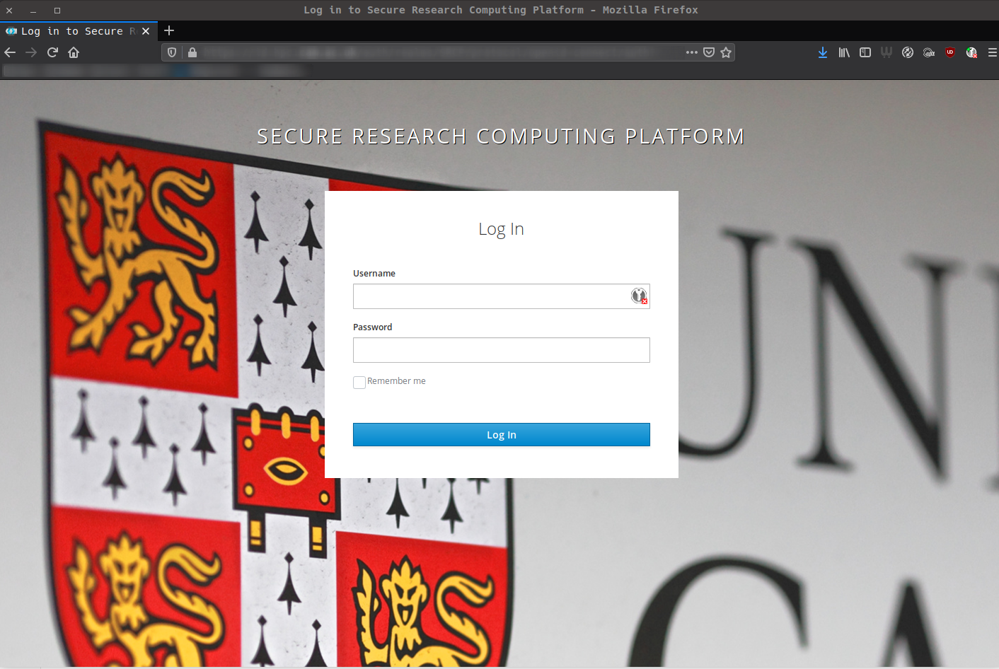
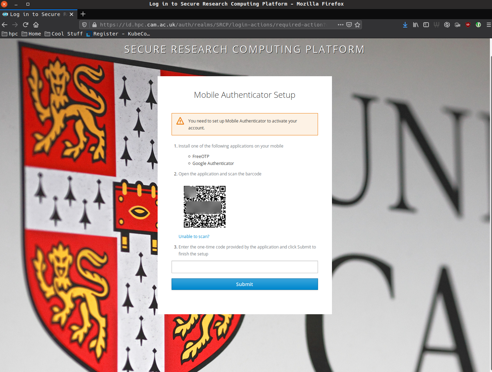

.. _login-first-time:

Logging in for the First Time
=============================

In order to connect to SRCP, you will need the following things:

1.  CRSid and associated password (AKA Raven account/password), which should have been provided to you as part of the Visiting Workers process
2.  Complete the `SRCP User Access Request <https://www.hpc.cam.ac.uk/srcp-request-user-access>`__ - you will be asked to “Log in with Raven”, use your CRSid and password. To complete the access request form you will also need the following information:
   -  SRCP platform type = vHPC
   -  User’s vHPC Level of Access = Project User
   -  Project Unique ID = will be provided by the data management team
3.  **Connection to the Cambridge University VPN** (instructions `here <https://help.uis.cam.ac.uk/service/network-services/remote-access/uis-vpn>`__)  or a computer that is on the Cambridge University Network
4.  The address of the epi-analysis SRCP platform: `epi-analysis.srcp.hpc.cam.ac.uk <https://epi-analysis.srcp.hpc.cam.ac.uk/>`__
5.  A mobile device to set up for two factor authentication

If you need help with any of this information, please `contact us <mailto:srcpg@mrc-epid.cam.ac.uk>`__

Configuring Two Factor Authentication
-------------------------------------

SRCP uses two factor authentication. The first time log in is attempted by going to `epi-analysis.srcp.hpc.cam.ac.uk <https://epi-analysis.srcp.hpc.cam.ac.uk/>`__, the following steps are needed:

-  Install the Two Factor Authentication application
-  Retrieve the Token
-  Configure the Application

Preparing Your Phone for Two Factor Authentication
--------------------------------------------------

There are several steps needed to configure your phone for use with SRCP.

Securing Your Phone
~~~~~~~~~~~~~~~~~~~

Information on securing your device is in the `SRCPS User Security Policy <https://docs.hpc.cam.ac.uk/srcp/isms-docs/security-policy.html#security-policy>`__. Please ensure this has been read and understood this before proceeding with configuring two factor authentication access.

Installing a Two Factor Authentication Application
~~~~~~~~~~~~~~~~~~~~~~~~~~~~~~~~~~~~~~~~~~~~~~~~~~

An application is needed to generate the one time login tokens which enable access to SRCP.

We support several mobile applications for both Android and iPhone:

+-----------------------------+-------------------------------------------------------------------------------+---------------------------------------------------------------------------------------------+
| Application                 | iPhone                                                                        | Android                                                                                     |
+=============================+===============================================================================+=============================================================================================+
| FreeOTP                     |`Yes <https://itunes.apple.com/gb/app/freeotp-authenticator/id872559395?mt=8>`_|`Yes <https://play.google.com/store/apps/details?id=org.fedorahosted.freeotp>`_              |
+-----------------------------+-------------------------------------------------------------------------------+---------------------------------------------------------------------------------------------+
| Google Authenticator        |`Yes <https://itunes.apple.com/gb/app/google-authenticator/id388497605?mt=8>`_ |`Yes <https://play.google.com/store/apps/details?id=com.google.android.apps.authenticator2>`_|
+-----------------------------+-------------------------------------------------------------------------------+---------------------------------------------------------------------------------------------+

Retrieving Your Token
---------------------

Adding a Token to a Mobile Phone
~~~~~~~~~~~~~~~~~~~~~~~~~~~~~~~~

Connect to the Cambridge University VPN and go to the `login page <https://epi-analysis.srcp.hpc.cam.ac.uk/>`__

Upon browsing to this page the user will be presented with a login page:

Here the user should enter their credentials to proceed - the CRSid and Raven password.

If this is the first time theuser has attempted to in they will be presented with a prompt to configure Two Factor Authentication. It will look similar to the image shown below.

The page has a barcode on it, which can be scanned by a Two Factor Authentication management application. There is a video below showing this process for an Android handset:

|Android|

Recovering from a lost token or device
~~~~~~~~~~~~~~~~~~~~~~~~~~~~~~~~~~~~~~

If a user loses their Time-based one-time password (TOTP) codes or mobile device, they will be unable to access the platform until they have raised a support request with the SRCP Support Team, who at that point are the only people who can regenerate the user’s TOTP codes. Before doing this however, the SRCP Support Team must go through a process to establish the real identity of this user. This involves confirming the reset with the MRC Epidemiology Unit team.

If you have lost your mobile device or token please submit a support request to the `SRCP helpdesk <mailto:support@hpc.cam.ac.uk>`__. The user must also notify the MRC Epidemiology Unit team with whom the SRCP helpdesk contacts for approval. This must happen before the SRCP helpdesk can issue a replacement token.

Once the MRC Epidemiology Unit has approved the token reset request and the user has demonstrated ownership of their password the Helpdesk will issue a new private token.

.. |android| image:: https://user-images.githubusercontent.com/8521654/234272219-f6e9bbb7-4e54-44b3-b1cd-f1f4bfd3d8de.png
   :target: https://player.vimeo.com/video/374700786
