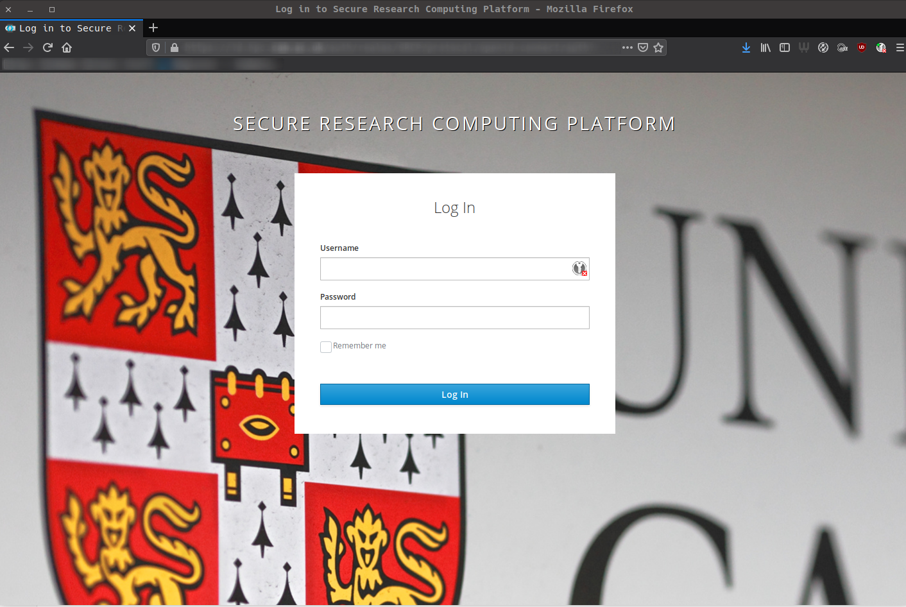

Basic Concepts
===============
.. _login-later:
Logging in to SRCP
------------------
If it is the **first time** you are logging in to SRCP, please refer to :ref:`login-first-time`.

For subsequent log ins you will need:

-  CRSid and associated password (AKA Raven password), which should have been provided as part of the Visiting Workers process
-  **Connection to the Cambridge University VPN** (instructions `here <https://help.uis.cam.ac.uk/service/network-services/remote-access/uis-vpn>`__) or a computer that is on the Cambridge University Network
-  The device that you set up for Two Factor Authentication (2FA) on SRCP
-  The address of the epi-analysis SRCP platform: `epi-analysis.srcp.hpc.cam.ac.uk <https://epi-analysis.srcp.hpc.cam.ac.uk/>`__
-  (The project identifier that was provided to you by the Data Management Team and is an 11 character alphanumeric string (e.g. cvh4y5kl3lr) - for starting a remote desktop session after log in. **Data Managers** should use the project ID that corresponds to the user whose data is being worked on)

You will be presented with the log in page shown below where you should use your CRSid and associated password (AKA Raven password) and 2FA to log in.

SRCP Landing Page
-----------------

After logging in at `epi-analysis.srcp.hpc.cam.ac.uk <https://epi-analysis.srcp.hpc.cam.ac.uk/>`__, you will be redirected to the SRCP landing page. This is the main page where users can start interactive remote desktop sessions and view compute jobs.

.. figure:: ../../images/landing-page.png
  :width: 800px
  :alt: SRCP landing page

The menus on the landing page provide access to the following:

-  Jobs - view compute batch jobs. Large computational tasks should be run as batch jobs.
-  Interactive Apps - start an interactive remote desktop session. This also is the route to running applications like RStudio or Jupyter, and for managing files.

.. _remote-desktop:
Interactive Apps - Remote Desktop Session
-----------------------------------------

To start a remote desktop session, click the Secure Remote Desktop link in the Interactive Apps menu. This takes you to a page where you can specify the duration of the session (maximum 12 hours) and the number of cores required (from 1 to the maximum available for your project). Your project has shared access to a dedicated node (or set of cores on a node) which is paid for on an annual basis. Therefore there is currently no hourly charge for using SRCP. However, you may be sharing resources with other users or colleagues who are working on the project with you, so only request the resources you need (e.g. a single core for prototyping code). Otherwise they may not be able to start a session and their job will be queued until resources are available. Note also that when the session closes after the specified number of hours work may be lost if files haven't been saved.

You will also need to specify the Account, Partition, Hours and Cores:

+------------+--------------------------------------------------------------------------------------------------------------------+
| Field      | Value                                                                                                              |
+============+====================================================================================================================+
| Account    | **Project identifier** - 11 character alphanumeric string (e.g. cvh4y5kl3lr)                                       |
|            | provided to you by the Data Management Team                                                                        |
+------------+--------------------------------------------------------------------------------------------------------------------+
| Partition  | **Project identifier** plus "-cpu" or "-gpu" (e.g. cvh4y5kl3lr-cpu)                                                |
+------------+--------------------------------------------------------------------------------------------------------------------+
| Hours      | Number of hours the session will run for. Make sure any work is saved before the session ends or work may be lost  |
+------------+--------------------------------------------------------------------------------------------------------------------+
| Cores      | Number of cores to use                                                                                             |
+------------+--------------------------------------------------------------------------------------------------------------------+

.. note::
   **Data Managers** should use the project ID that corresponds to the user whose data is being worked on

.. figure:: ../../images/remote-desktop-dialogue.png
  :scale: 80 %
  :alt: SRCP remote desktop dialogue box

When the “launch” button is clicked, the session is placed in a queue. The session card will turn green when the requested number of cores are available, and the “Launch Secure Remote Desktop” button becomes available. When you click the button the session is opened in a new tab in your browser.

The remote desktop
~~~~~~~~~~~~~~~~~~

The remote desktop gives you the option of working with files and folders via a GUI rather than command line via the File Manager application (highlighted in blue). All other applications are launched from the Terminal (highlighted in green). A separate section in this wiki contains instructions for running commonly used applications such as RStudio.

.. figure:: ../../images/remote-desktop-example.png
  :scale: 70 %
  :alt: SRCP remote desktop session example

Disabling the lock screen
~~~~~~~~~~~~~~~~~~~~~~~~~
If a session is left idle, the lock screen will activate. You will be prompted for your password to unlock your session (the same as the log in password):

The lock screen can be disabled through the Applications menu:

Folder structure on SRCP
------------------------

There are 4 main folders in the main ``/srv/`` folder:

::

   ├── srv
   │   ├── home
   │   │   ├── each user has a folder corresponding to their username e.g. bb123
   │   ├── projects
   │   │   ├── users will only be able to see project folders that they have access to
   │   ├── data-manager
   │   │   ├── not accessible to non-data manager users
   │   └── shared
   │       ├── scripts subfolder
   │       ├── licenses subfolder

-  ``home`` - each user has a folder with 50GB of space, the name of the folder corresponds to their username e.g. bb123
-  ``projects`` - you will only have access to your project, and the Data Management Team will confirm the name of your folder. The data you requested should be found in the read-only **data** folder. You can keep code and copies of the data in the **analysis** subfolder. There is 1TB of space available.
-  ``data-manager`` - used by Data Managers to transfer data in and out of SRCP - not accessible to users
-  ``shared`` - contains license files (and in the future helpful code snippets)

All data is backed up across 2 sites and lost files can be recovered in the event of a disaster or accidental deletion.

**TO DO - mention symlink to project folder, use quota command to check space (does this work?)**

File Manager application
------------------------

The File Manager application is similar to the Windows Explorer application, in that it can be used to open, explore, copy, cut, paste, move and delete files and folders. When the application is launched, you will be in your home folder ``/srv/home/<user-id>``. The 'up arrow' (highlighted in green) can be used to move up a folder level. This allows you to reach the ``/srv/`` folder.

Finding data in your project using File Manager
~~~~~~~~~~~~~~~~~~~~~~~~~~~~~~~~~~~~~~~~~~~~~~~

To find the data for your project:

1. Use the 'up arrow' described above to navigate to the ``/srv/`` folder.
2. Double click on the ``projects`` folder

3. You will see a list of the folders you have access to. In most cases you will only have access to one project. Double click on the project folder required to open it.

4. In your project folder, there is a subfolder called ``data``. This is where you will find the data. The ``analysis`` folder is empty and this is where you can save your code and copies of the data.

