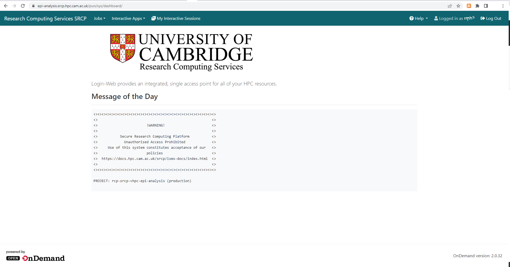
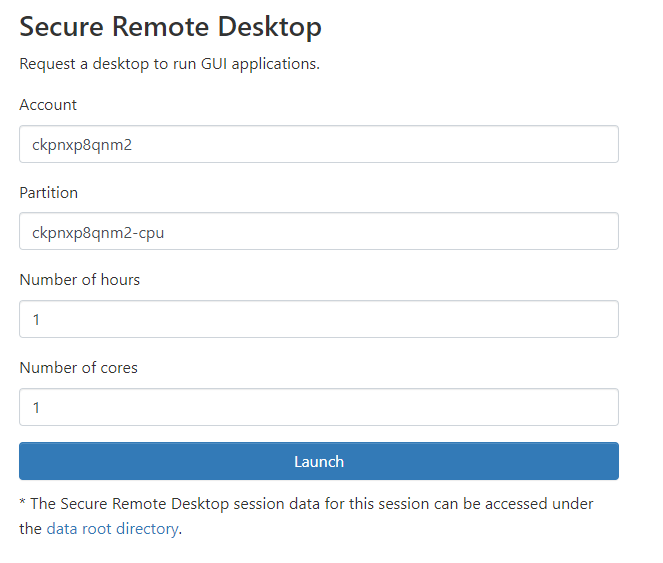
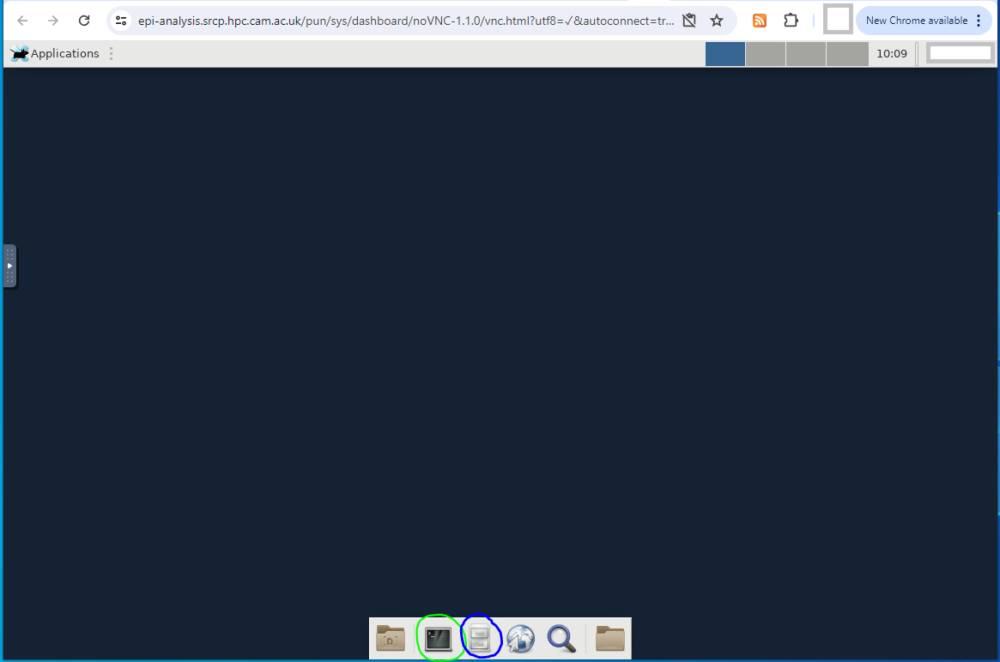

Getting Started
===============

SRCP Landing Page
-----------------

After logging in at `epi-analysis.srcp.hpc.cam.ac.uk <https://epi-analysis.srcp.hpc.cam.ac.uk/>`__, you will be redirected to the SRCP landing page. This is the main page where users can start interactive remote desktop sessions and view compute jobs.

The menus on the landing page provide access to the following:

-  Jobs - view compute batch jobs. Large computational tasks should be run as batch jobs.
-  Interactive Apps - start an interactive remote desktop session. This also is the route to running applications like RStudio or Jupyter, and for managing files.

Interactive Apps - Remote Desktop Session
-----------------------------------------

To start a remote desktop session, click the Secure Remote Desktop link in the Interactive Apps menu. This takes you to a page where you can specify the duration of the session (maximum 12 hours) and the number of cores required (from 1 to the maximum available for your project). You will also need to specify the Account and Partition. The Account field should be set to your **project identifier** . The **project identifier** is provided to you by the Data Management Team and is an 11 character alphanumeric string (e.g. cvh4y5kl3lr). The Partition field requires the project identifier plus “-cpu” or “-gpu”:

When the “launch” button is clicked, the session is placed in a queue. The session card will turn green when the requested number of cores are available, and the “Launch Secure Remote Desktop” button becomes available. When you click the button the session is opened in a new tab in your browser.

.. figure:: ../../images/remote-desktop-session-card.png
  :scale: 80 %
  :alt: SRCP remote desktop session card

The remote desktop gives you the option of working with files and folders via a GUI rather than command line via the File Manager application (highlighted in blue). All other applications are launched from the Terminal (highlighted in green). A separate section in this wiki contains instructions for running commonly used applications such as RStudio.

Folder structure on SRCP
------------------------

There are 4 main folders in the main ``/srv/`` folder:

-  ``home`` - each user has a folder with 50GB of space
-  ``projects`` - you will only have access to your project. The data you requested should be found in this folder. There is 1TB of space available.
-  ``data-manager`` - used by Data Managers to transfer data in and out of SRCP - not accessible to users
-  ``shared`` - contains license files (and in the future helpful code snippets)

All data is backed up across 2 sites and lost files can be recovered in the event of a disaster or accidental deletion.

**TO DO - mention symlink to project folder, use quota command to check space (does this work?)**
