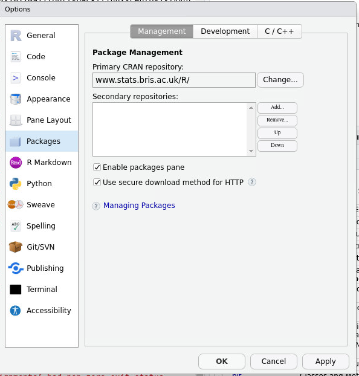
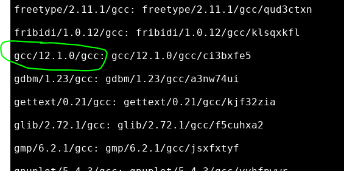

Running applications through the remote desktop
===============================================

The remote desktop provides an interactive session for users. This allows the use of applications such as RStudio and Jupyter.

**NOTE** The SRCP platform is isolated from the internet to prevent data from being removed. Common package repositories such as *CRAN* and *conda forge* have been whitelisted so that packages can be installed by the user from these locations. If you require code that is held in **GitHub**, this will need to be brought into SRCP via the Data Transfer process as a zip file (see :ref:`data-transfer`). Similarly, Docker containers will need to be brought in and run through Singularity/Apptainer. The reason for this is that we cannot allow direct access to GitHub and DockerHub as this would give users the ability to remove data without permission by pushing to these locations.

Basic file editing
------------------
From the command line, ``vim`` can be used to edit files, but can be rather challenging to use. An alternative is to use ``gedit`` from the command line which will load the file into `gedit <https://help.gnome.org/users/gedit/stable/>`__ which is a more user-friendly interface.

RStudio
-------

1. Find the RStudio module: ``$ module avail`` or ``$ module keyword studio`` and load it with ``$ module load xxxxxx`` where ``xxxxxx`` is the module name
2. Start RStudio ``$ rstudio``
3. The RStudio window should open
4. While general access to the internet is not available, it is possible install R packages from the UK CRAN mirrors using a command like ``install.packages("my_package", repo = "www.stats.bris.ac.uk/R")``
5. If you require a package that is not available on CRAN, then please contact support

**TIP** you can set your default CRAN to ``www.stats.bris.ac.uk/R`` in the Global Options menu:

.. note::
   If you run into build errors, there are some tips `here <https://docs.hpc.cam.ac.uk/hpc/software-packages/r.html#installing-r-packages>`__

Bioconductor
~~~~~~~~~~~~

Bioconductor can be installed in the usual way as the necessary repositories have been whitelisted. You may need to set the default CRAN in your options as described above.

Conda
-----

1. Find the miniconda module: ``$ module avail`` or ``$ module keyword conda`` and load it with ``$ module load xxxxxx``
2. While general access to the internet is not available, it is possible install packages from the ``conda-forge`` channel
3. If you require a package that is not available on ``conda-forge``, then please contact support

**todo** do we need Python virtualenv too?

Jupyter
-------

1. Find the gcc module: ``$ module avail`` and load it with ``$ module load xxxxxx``:

2. Find the **py-jupyterlab-server** module:
   ``$ module keyword jupyter`` and load it with
   ``$ module load xxxxxx``
3. Start a jupyter notebook: ``$ jupyter notebook`` - a browser window should open

Stata
-----

1. Find the Stata module: ``$ module keyword stata`` and load it with ``$ module load xxxxxx``
2. Start Stata: ``$ xstata`` for the basic edition or ``$ xstata-mp`` for Stata/MP

.. figure:: ../../images/stata.png
  :scale: 60 %
  :alt: Stata

Apptainer (Singularity)
-----------------------

Containers can be brought into SRCP in the .sif format via the file transfer process. Apptainer is available from the command line:
::

$ apptainer exec lolcow_latest.sif cowsay moo

Genetics Tools
--------------

PLINK, vcftools and  bcftools
~~~~~~~~~~~~~~~~~~~~~~~~~~~~~

These can all be loaded as modules. For example for PLINK:

1. ``$ module keyword plink`` and load it with
2. ``$ module load xxxxxx``

Then PLINK can be run as normal

METAL, REGENIE, SNPTest
~~~~~~~~~~~~~~~~~~~~~~~
These executables can be imported throught the file transfer process

Variant Effect Predictor
~~~~~~~~~~~~~~~~~~~~~~~~
TBC - (https://www.ensembl.org/info/docs/tools/vep/index.html)

