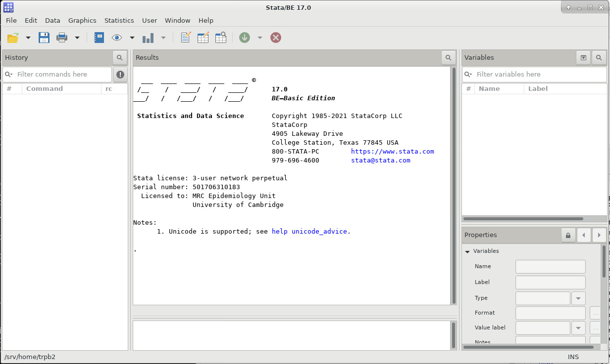

Running applications through the remote desktop
===============================================

The remote desktop provides an interactive session for users. This allows the use of applications such as RStudio and Jupyter.

**NOTE** The SRCP platform is isolated from the internet to prevent data from being removed. Common package repositories such as *CRAN* and *conda forge* have been whitelisted so that packages can be installed by the user from these locations. If you require code that is held in **GitHub**, this will need to be brought into SRCP via the Data Transfer process as a zip file (see :ref:`data-transfer`). Similarly, Docker containers will need to be brought in and run through Singularity/Apptainer. The reason for this is that we cannot allow direct access to GitHub and DockerHub as this would give users the ability to remove data without permission by pushing to these locations.

Basic file editing
------------------
From the command line, ``vim`` can be used to edit files, but can be rather challenging to use. An alternative is to use ``gedit`` from the command line which will load the file into `gedit <https://help.gnome.org/users/gedit/stable/>`__ which is a more user-friendly interface.

RStudio
-------

1. Find the RStudio module: ``$ module avail`` or ``$ module keyword studio`` and load it with ``$ module load xxxxxx`` where ``xxxxxx`` is the full module name
2. Start RStudio ``$ rstudio``
3. The RStudio window should open

Set default CRAN
~~~~~~~~~~~~~~~~
For easier package installation, set your default CRAN to ``https://www.stats.bris.ac.uk/R`` in the Tools -> Global Options menu (only needs to be done once):

.. figure:: ../../images/rstudio-global-options.png
  :scale: 70 %
  :alt: RStudio

R Package Installation
~~~~~~~~~~~~~~~~~~~~~~

While general access to the internet is not available, it is possible install R packages from the UK CRAN mirrors using a command like ``install.packages("my_package", repo = "www.stats.bris.ac.uk/R")``. If you have set the default CRAN (as described above), the ``repo=`` part can be left out. If you require a package that is not available on CRAN, then please contact us (srcp@mrc-epid.cam.ac.uk)

R packages are often not written entirely in R, but in low-level, compiled languages, most typically C++ and Fortran, for speed. This requires various compilers, headers and libraries for the packages to compile properly. On SRCP, these might have to be loaded as separate modules before you start R. For example, you might see an error like this:

This describes the library that is missing. You can search for a module that provides the library by doing ``$ module keyword harf`` or similar and then load the module that is found with ``$ module load xxxxxx`` where ``xxxxxx`` is the module name (e.g. harfbuzz/4.2.1/gcc). Note that in this example there are 2 libraries needed - harfbuzz and fribidi. Both of the corresponding modules will need to be loaded **before** starting RStudio. Generally, once the package has been installed, you will not need to load these modules for subsequent sessions.

Bioconductor
~~~~~~~~~~~~

Bioconductor can be installed in the usual way as the necessary repositories have been whitelisted. You may need to set the default CRAN in your options as described above.

Python
------
The SRCP provides a central installation of Python 3. Some of the most common packages used for scientific computation and data analysis (e.g. pandas) are available as modules. To view the packages available as modules, search for the keyword "python" ``$ module keyword python`` and load the module required as usual.

If additional packages are required, it is recommended that this is done through Conda environments. While ``venv`` is available to provide environments and ``pip`` to install packages, access to the pypi repository is currently disabled.

Conda
~~~~~

1. Find the full miniconda module name: ``$ module avail`` or ``$ module keyword conda`` and load it with ``$ module load xxxxxx``
2. While general access to the internet is not available, it is possible install packages from the ``conda-forge`` channel
3. If you require a package that is not available on ``conda-forge``, then please contact support.

Jupyter Notebooks for Python
~~~~~~~~~~~~~~~~~~~~~~~~~~~~

Several options exist for running Jupyter notebooks on the SRCP:

1. Load Jupyter as a module, along with other packages required
2. Create a Conda environment, and install Jupyter packages alongside other packages required in that environment
3. Load Jupyter as a module, create a kernel for the Conda environment, install other packages required in the environment

Jupyter notebook as a module (no virtual environment)
^^^^^^^^^^^^^^^^^^^^^^^^^^^^^^^^^^^^^^^^^^^^^^^^^^^^^
1. Find the **py-jupyterlab** module:
   ``$ module keyword jupyter`` and load it with
   ``$ module load xxxxxx``
2. Load other modules required (e.g. pandas):
    ``$ module load py-pandas/1.5.3
3. Start a jupyter notebook: ``$ jupyter lab`` - a browser window should open

Jupyter notebook in a Conda environment
^^^^^^^^^^^^^^^^^^^^^^^^^^^^^^^^^^^^^^^
1. Create a Conda environment: ``$ conda create -n my-conda-env``
2. Activate the environment: ``$ conda activate my-conda-env``
3. Install jupyter in the environment: ``$ conda install jupyter``
4. Install other packages as required
5. Start notebook: ``$ jupyter notebook``

Jupyter notebook as a module with Conda environment
^^^^^^^^^^^^^^^^^^^^^^^^^^^^^^^^^^^^^^^^^^^^^^^^^^^
To do

Stata
-----

1. Find the full Stata module name: ``$ module keyword stata`` and load it with ``$ module load xxxxxx``
2. Start Stata: ``$ xstata`` for the basic edition or ``$ xstata-mp`` for Stata/MP

Apptainer (Singularity)
-----------------------

Containers can be brought into SRCP in the .sif format via the file transfer process. Apptainer is available from the command line:
::

$ apptainer exec lolcow_latest.sif cowsay moo

Genetics Tools
--------------

PLINK, vcftools and  bcftools
~~~~~~~~~~~~~~~~~~~~~~~~~~~~~

These can all be loaded as modules. For example for PLINK:

1. ``$ module keyword plink`` and load it with
2. ``$ module load xxxxxx``

Then PLINK can be run as normal

METAL, REGENIE, SNPTest
~~~~~~~~~~~~~~~~~~~~~~~
These executables can be imported throught the file transfer process

Variant Effect Predictor
~~~~~~~~~~~~~~~~~~~~~~~~
TBC - (https://www.ensembl.org/info/docs/tools/vep/index.html)

