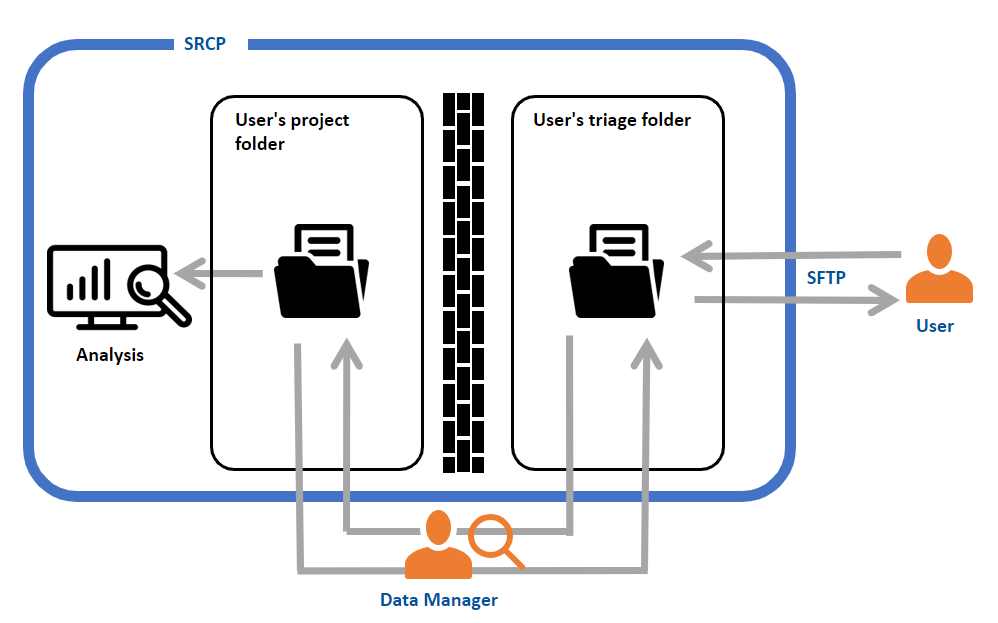
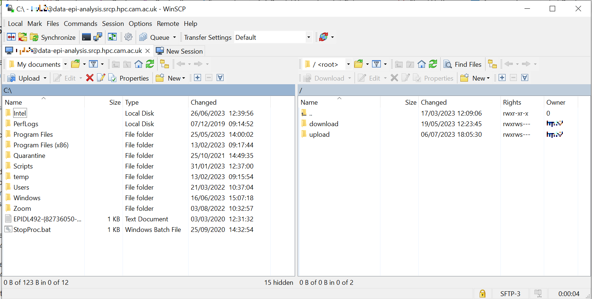

.. _data-transfer:

Taking files in and out of the SRCP
================================

Overview
--------

The SRCP platform enforces strict controls and full auditing of all files moved in and out to: 

- Protect participant confidentiality 
- Prevent unauthorised data removal 
- Prevent unauthorised or unsafe files entering the system 

Users **cannot access their project folders directly from outside the SRCP**. All file transfers must go through a controlled triage process handled by a Data Manager. All analysis must be conducted within the SRCP. Only **summary-level (aggregate) results** may be taken out. Individual-level data can never be removed under any circumstances. To strengthen these measures further, user should take out the minimum data necessary for research (e.g. writing up final results).

Files are moved in and out of the SRCP **using SFTP** (SSH File Transfer Protocol) and requires an SFTP client to be set up on your local computer - see below.

Disclosure Control Rules (for taking files out)
------------------------------------------------

Before any file is released from the SRCP, a Data Manager will review it to ensure it meets the Disclosure Control Rules. 

Files to be taken out must: 

- Contain **summary (aggregate) results only**
- Contain **no individual-level data**
- Contain **no participant or sample IDs** 
- Clearly label all results 
- Mask small counts (any count < 10 must be suppressed or masked) and prevent small counts from being derived 
- Be limited to final results wherever possible (avoid exporting large numbers of intermediate files) 

When requesting files to be taken out, you must provide: 

- The file name and location (note files in your home folder are not accessible by Data Managers) 
- A description of what the file contains 
- How it was generated and if appropriate the code/environment required to load the file 
- Why it is relevant to your research question 

Large or unclear requests will be returned for revision. 

Machine learning models
~~~~~~~~~~~~~~~~~~~~~~~~~~
While developing machine learning (ML) models offers significant opportunities, removing trained models from the SRCP poses disclosure risks that are not yet fully addressed by existing guidance. Unlike conventional statistical outputs, ML models are a relatively new research output with less well-understood potential to reveal individual-level information, and there is limited consensus on how to assess and mitigate these risks once models leave the SRCP. As best practice continues to evolve in collaboration with external experts, our interim policy is to generally prohibit removing trained ML models from the SRCP unless there is compelling evidence that they do not present disclosure risk, although model performance metrics and hyperparameters may be released subject to standard output checking.

Taking Files Into the SRCP
----------------------------

All files taken into the SRCP are reviewed before being moved into your project folder. This ensures: 

- Participant data remains protected 
- Research policy compliance 
- No malicious software is introduced 

For data files to be approved: 

- The data must be approved for use in your research question (if not publicly available)
- If a particular software environment is needed to open the file, this must be provided

For code to be approved: 

- The code must be relevant to your research 
- The source must be reputable 
- It must not contain malware 

You must explain why the uploaded file is necessary for your research. 

The SRCP Triage System
----------------------

Each user is assigned a personal **triage area**, accessible externally via SFTP. 

There are two folders: 

Upload folder – for approved files entering the SRCP 
Download folder – for approved files leaving the SRCP 

Important: 

- You cannot move files directly between your triage area and your project folder. 
- Only a Data Manager can transfer files between these areas. 
- You must notify a Data Manager when files are ready for review. 
- Once approved, files are transferred and immediately available. 

Summary of process for downloading files
~~~~~~~~~~~~~~~~~~~~~~~~~~~~~~~~~~~~~

1. A user wishes to download some results from the SRCP
2. They `notify a Data Manager <https://mrc-epid-dmt.atlassian.net/servicedesk/customer/portal/6>`__ of the file name, location (e.g. their project folder) and a statement of how it meets the Disclosure Control Rules (see above)
3. The Data Manager inspects the file and confirms that it contains results, not any individual level data
4. The Data Manager copies the file from the user’s project folder to their “download” triage folder and notifies the user
5. The user connects to their “download” triage folder using SFTP and downloads the file

Summary of process for uploading files
~~~~~~~~~~~~~~~~~~~~~~~~~~~~~~~~~~~

1. A user wishes to upload some supplementary data or code to the SRCP
2. The user connects to their “upload” triage folder using SFTP and uploads the file
3. They `notify a Data Manager <https://mrc-epid-dmt.atlassian.net/servicedesk/customer/portal/6>`__  of the file name, location (their “upload” triage folder) and a statement that permission has been granted for the data to be used in this research (data) or that the code is from a reputable source (code). Describe why the items are needed for the research.
4. The Data Manager inspects the file and confirms that it contains appropriate data/code
5. The Data Manager copies the file from the user’s “upload” triage folder to the user’s project folder and notifies the user
6. The user uses the file that is now available in their project folder

.. _SFTP-client:
Connecting to epi-analysis SRCP with SFTP
-----------------------------------------

The **address** of the epi-analysis SFTP site is ``data-epi-analysis.srcp.hpc.cam.ac.uk``.

The **username**, **password** and **2 factor authentication device** are the same as those used to log into the web interface. A connection to the Cambridge VPN is required.

SFTP Clients
~~~~~~~~~~~~

To connect, an `SFTP client <https://www.sftp.net/clients>`__ is required such as:

-  `FileZilla <https://filezilla-project.org>`__
-  `WinSCP <https://winscp.net>`__
-  `CyberDuck <https://cyberduck.io>`__
-  `rsync <https://linux.die.net/man/1/rsync>`__
-  `sftp <https://linux.die.net/man/1/sftp>`__

When setting up the Client, check that the host key matches one of these keys:

.. code-block:: console

   SHA256:j1/yov0yGMla50k3KsPiSK7fVFcjAul7goglZXG7s1o (ECDSA)
   SHA256:rLA8ooUEnrbUBL7fPolOH6D2akF9PqZXp3EtWnhGWxI (ED25519)
   SHA256:Veb3XsMSZom7dng3FHUNvbMr6wBMcfCcZ//6pTmsWgk (RSA)

If your client ever warns that the host key has changed, and it does not match one of these keys then do not proceed and contact srcpdata@mrc-epid.cam.ac.uk

Example of setting up WinSCP
~~~~~~~~~~~~~~~~~~~~~~~~~~~~

1. Connect to the Cambridge VPN (or use a computer that is connected to the Cambridge Network)

2. Start WinSCP where you will be presented with the Login dialogue

.. figure:: ../../images/winscp-login.png
  :scale: 50 %
  :alt: WinSCP login page

3. Choose SFTP as the protocol, enter the hostname as **data-epi-analysis.srcp.hpc.cam.ac.uk**, set the port to 22 and enter your CRSid as the username (i.e. the same username you use to log into the SRCP web interface).

.. figure:: ../../images/winscp-setup.png
  :scale: 50 %
  :alt: WinSCP login settings

4. Click Save and then click OK to save the session as a site. This will allow you to reconnected more easily in the future.

5. You will see a warning about the server key not being found in the cache. Check that the key matches one of these keys:

.. code-block:: console

   SHA256:j1/yov0yGMla50k3KsPiSK7fVFcjAul7goglZXG7s1o (ECDSA)
   SHA256:rLA8ooUEnrbUBL7fPolOH6D2akF9PqZXp3EtWnhGWxI (ED25519)
   SHA256:Veb3XsMSZom7dng3FHUNvbMr6wBMcfCcZ//6pTmsWgk (RSA)

If it is not one of these keys, then click Cancel and contact srcpdata@mrc-epid.cam.ac.uk

.. _SFTP-upload:
Example of uploading files using WinSCP
~~~~~~~~~~~~~~~~~~~~~~~~~~~~~~~~~~~~~~~

1. Connect to the Cambridge VPN  (or use a computer that is connected to the Cambridge Network)

2. Start WinSCP where you will be presented with the Login dialogue. Select the session for the SRCP that you saved previously

.. figure:: ../../images/winscp-prev-login.png
  :scale: 50 %
  :alt: WinSCP saved login settings

3. Click the Login button.

4. Enter your CRS/Raven password (the same as for the SRCP web interface) and then enter a TOTP from your mobile device for 2 factor authentication (the same as for the SRCP web interface)

.. figure:: ../../images/winscp-totp.png
  :scale: 50 %
  :alt: WinSCP TOTP log in

5. You should now be connected. The triage upload and download folders on the SRCP are shown on the right, and your local machine’s folders on the left. You can transfer files between these locations.

6. Locate the file on your local machine (left side) that you wish to upload. Drag and drop it into the upload folder on the SRCP (right side)

.. figure:: ../../images/winscp-upload.png
  :scale: 50 %
  :alt: WinSCP file upload

7. `Notify a Data Manager <https://mrc-epid-dmt.atlassian.net/servicedesk/customer/portal/6>`__  and let them know that you need files copies from your “upload” folder to your project folder. They will check the files, copy them to your project folder if all is OK and notify you that the files are available or advise what changes are needed.

.. _SFTP-download:
Example of downloading files using WinSCP
~~~~~~~~~~~~~~~~~~~~~~~~~~~~~~~~~~~~~~~~~

1. `Notify a Data Manager <https://mrc-epid-dmt.atlassian.net/servicedesk/customer/portal/6>`__  and let them know that you need files copied from your project folder to your “download” folder. Provide a statement of how the files meet the Disclosure Control Rules (see above). They will check the files, copy them to your download folder if all is OK and notify you that they are available for download or advise what changes are needed.

2. When you have received notification from the Data Manager that the files are ready for you to download, connect to the Cambridge VPN.

3. Start WinSCP where you will be presented with the Login dialogue. Select the session for the SRCP that you saved previously

.. figure:: ../../images/winscp-prev-login.png
  :scale: 50 %
  :alt: WinSCRP saved login

4. Click the Login button.

5. Enter your CRS/Raven password (the same as for the SRCP web interface) and then enter a TOTP from your mobile device for 2 factor authentication (the same as for the SRCP web interface)

.. figure:: ../../images/winscp-totp.png
  :scale: 50 %
  :alt: WinSCRP TOTP login

6. You should now be connected. The triage upload and download folders on the SRCP are shown on the right, and your local machine’s folders on the left. You can transfer files between these locations.

7. Locate the file on the SRCP (right side) that you wish to download. Drag and drop it to the required folder on your local machine (left side)

.. figure:: ../../images/winscp-download.png
  :scale: 50 %
  :alt: WinSCRP file download
