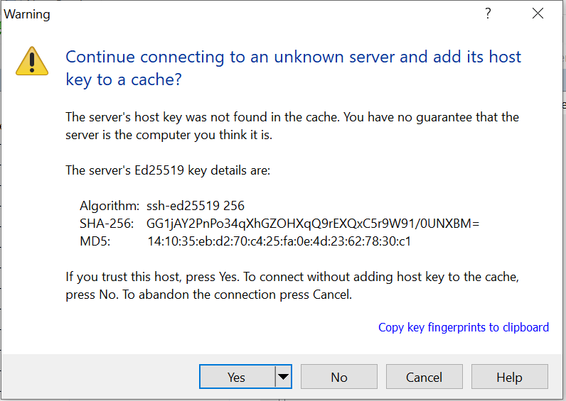
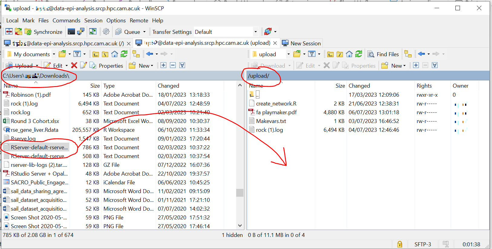
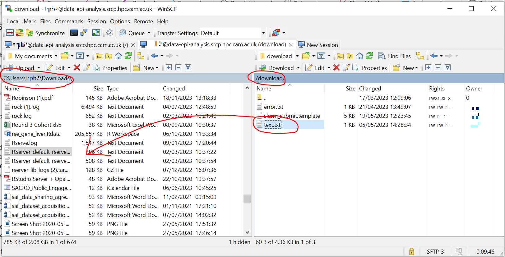

.. _data-transfer:

Taking files on and off the SRCP
================================

Explanation of file transfers on the SRCP
-----------------------------------------

An important feature of the SRCP Platform is the strict control and auditing over the upload and download of files. Users cannot access their project folder from outside the SRCP. This prevents data from being removed from or brought onto the system without permission. Before any file is released from the system, it is checked by a Data Manager to ensure that it meets the **Disclosure Control Rules**:

-  provide a description of what the file contains, how it was generated
   and its relevance to the research question
-  files should only contain aggregated, summary results, not individual values
-  results are clearly labelled
-  files should not have any participant or sample IDs
-  mask phenotype counts lower than 10 (e.g. if the results show 3 people have lung cancer, this should be masked)

Data brought onto the system should be cleared for use on the research question. Code that is being brought in should be sourced from a reputable location so that it does not contain malware. In the SRCP the transfer process is managed by using a triage location for each user that is only accessible to the user from outside the SRCP. They can use SFTP to transfer files to and from the triage location. Only a Data Manager can copy files between a user’s project folder and the triage folder after inspecting them. It is the responsibility of the users to notify a Data Manager that files are awaiting approval so they can authorise and copy them. Once the copy is complete, the files are available to the user immediately.

.. figure:: ../../images/file-triage.png
  :scale: 70 %
  :alt: SRCP file triage process

Process for downloading files
~~~~~~~~~~~~~~~~~~~~~~~~~~~~~

1. A user wishes to download some results from the SRCP
2. They notify a Data Manager (srcpdata@mrc-epid.cam.ac.uk) of the file name, location (e.g. their project folder) and a statement of how it meets the Disclosure Control Rules (see above)
3. The Data Manager inspects the file and confirms that it contains results, not any individual level data
4. The Data Manager copies the file from the user’s project folder to their “download” triage folder and notifies the user
5. The user connects to their “download” triage folder using SFTP and downloads the file

Process for uploading files
~~~~~~~~~~~~~~~~~~~~~~~~~~~

1. A user wishes to upload some supplementary data to SRCP
2. The user connects to their “upload” triage folder using SFTP and uploads the file
3. They notify a Data Manager (srcpdata@mrc-epid.cam.ac.uk) of the file name, location (their “upload” triage folder) and a statement that permission has been granted for the data to be used in this research (data) or that the code is from a reputable source (code)
4. The Data Manager inspects the file and confirms that it contains appropriate data/code
5. The Data Manager copies the file from the user’s “upload” triage folder to the user’s project folder and notifies the user
6. The user uses the file that is now available in their project folder

.. _SFTP-client:
Connecting to epi-analysis SRCP with SFTP
-----------------------------------------

The **address** of the epi-analysis SFTP site is ``data-epi-analysis.srcp.hpc.cam.ac.uk``.

The **username**, **password** and **2 factor authentication device** are the same as those used to log into the web interface.

SFTP Clients
~~~~~~~~~~~~

To connect, an `SFTP client <https://www.sftp.net/clients>`__ is required such as:

-  `FileZilla <https://filezilla-project.org>`__
-  `WinSCP <https://winscp.net>`__
-  `CyberDuck <https://cyberduck.io>`__
-  `rsync <https://linux.die.net/man/1/rsync>`__
-  `sftp <https://linux.die.net/man/1/sftp>`__

.. note::
   When setting up the Client, check that the host key matches ``SHA256:adCe50mCH97ui49A9zEpq1uitolpLoCGawLMnLTBPOk``. If your client ever warns that the host key has changed, and it does not match this key then do not proceed and contact srcpdata@mrc-epid.cam.ac.uk

Example of setting up WinSCP
~~~~~~~~~~~~~~~~~~~~~~~~~~~~

1. Connect to the Cambridge VPN (or use a computer that is connected to the Cambridge Network)

2. Start WinSCP where you will be presented with the Login dialogue

3. Choose SFTP as the protocol, enter the hostname as **data-epi-analysis.srcp.hpc.cam.ac.uk**, set the port to 22 and enter your CRSid as the username (i.e. the same username you use to log into the SRCP web interface).

4. Click Save and then click OK to save the session as a site. This will allow you to reconnected more easily in the future.

5. You will see a warning about the server key not being found in the cache:

Check that the key is ``SHA-256:  adCe50mCH97ui49A9zEpq1uitolpLoCGawLMnLTBPOk``. If it is not, then click Cancel and contact srcpdata@mrc-epid.cam.ac.uk

.. _SFTP-upload:
Example of uploading files using WinSCP
~~~~~~~~~~~~~~~~~~~~~~~~~~~~~~~~~~~~~~~

1. Connect to the Cambridge VPN  (or use a computer that is connected to the Cambridge Network)

2. Start WinSCP where you will be presented with the Login dialogue. Select the session for the SRCP that you saved previously

.. figure:: ../../images/winscp-prev-login.png
  :scale: 50 %
  :alt: WinSCP saved login settings

3. Click the Login button.

4. Enter your CRS/Raven password (the same as for the SRCP web interface) and then enter a TOTP from your mobile device for 2 factor authentication (the same as for the SRCP web interface)

.. figure:: ../../images/winscp-totp.png
  :scale: 50 %
  :alt: WinSCP TOTP log in

5. You should now be connected. The triage upload and download folders on the SRCP are shown on the right, and your local machine’s folders on the left. You can transfer files between these locations.

.. figure:: ../../images/winscp-landing.png
  :scale: 50 %
  :alt: WinSCP landing page

6. Locate the file on your local machine (left side) that you wish to upload. Drag and drop it into the upload folder on the SRCP (right side)

7. Contact a Data Manager (srcpdata@mrc-epid.cam.ac.uk) and let them know that you need files copies from your “upload” folder to your project folder. They will check the files, copy them to your project folder if all is OK and notify you that the files are available or advise what changes are needed.

.. _SFTP-download:
Example of downloading files using WinSCP
~~~~~~~~~~~~~~~~~~~~~~~~~~~~~~~~~~~~~~~~~

0. **TO DO - make sure permissions are set so that DM can read the
   file**

1. Contact a Data Manager (srcpdata@mrc-epid.cam.ac.uk) and let them know that you need files copied from your project folder to your “download” folder. Provide a statement of how the files meet the Disclosure Control Rules (see above). They will check the files, copy them to your download folder if all is OK and notify you that they are available for download or advise what changes are needed.

2. When you have received notification from the Data Manager that the files are ready for you to download, connect to the Cambridge VPN.

3. Start WinSCP where you will be presented with the Login dialogue. Select the session for the SRCP that you saved previously

.. figure:: ../../images/winscp-prev-login.png
  :scale: 50 %
  :alt: WinSCRP saved login

4. Click the Login button.

5. Enter your CRS/Raven password (the same as for the SRCP web interface) and then enter a TOTP from your mobile device for 2 factor authentication (the same as for the SRCP web interface)

.. figure:: ../../images/winscp-totp.png
  :scale: 50 %
  :alt: WinSCRP TOTP login

6. You should now be connected. The triage upload and download folders on the SRCP are shown on the right, and your local machine’s folders on the left. You can transfer files between these locations.

.. figure:: ../../images/winscp-landing.png
  :scale: 50 %
  :alt: WinSCRP saved login

7. Locate the file on the SRCP (right side) that you wish to download. Drag and drop it to the required folder on your local machine (left side)

