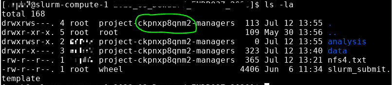
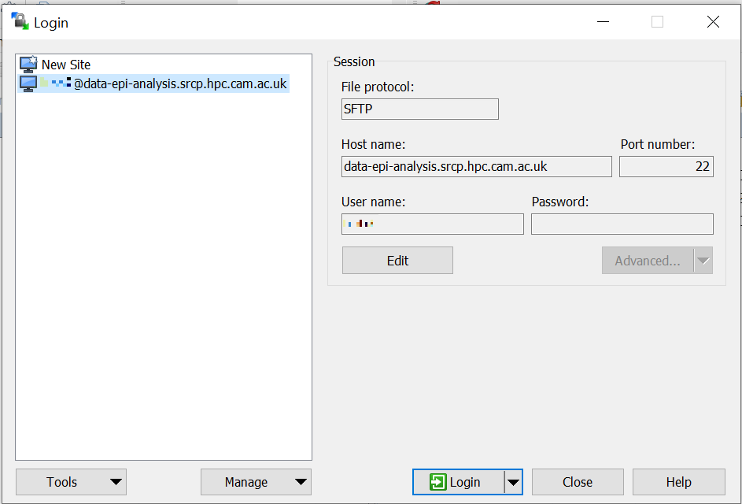
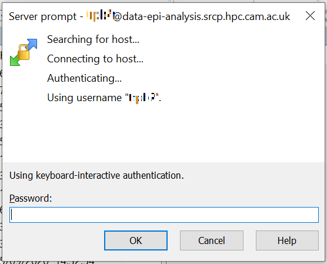
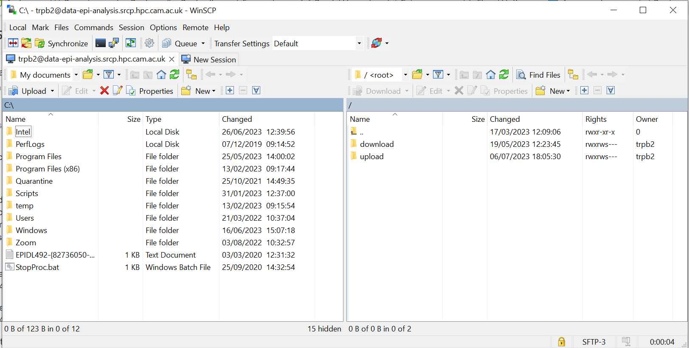
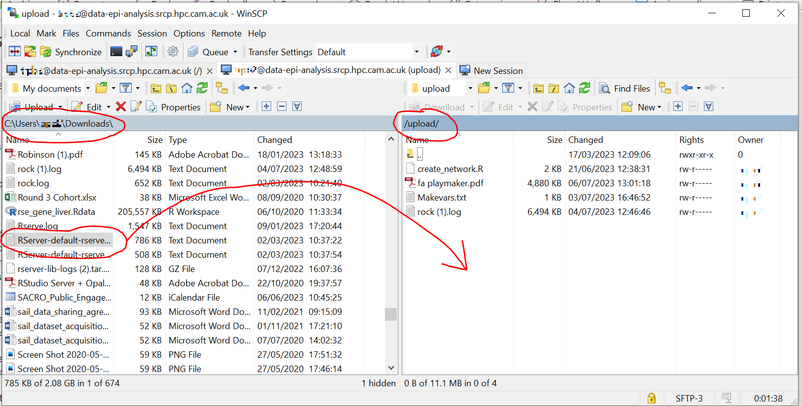
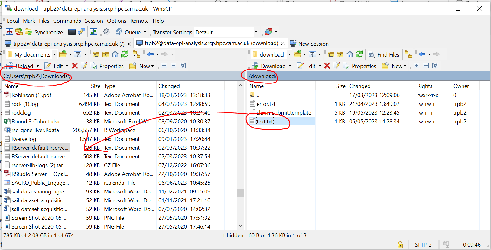

Data management
===============

This section is for MRC Epidemiology Data Managers.

Overview
--------

Data Managers are responsible for:

1. Initially bringing study data requested by the user into SRCP
2. Creating folders within the project and setting permissions for the study data
3. Moving data between the “upload” and “download” triage folders and a user’s project folder (e.g. bringing code in or results out)
4. Checking data/code that is brought in or out of SRCP to make sure it does not contain anything it shouldn't

.. note::
   When Data Managers (and users) connect to a remote desktop session, this uses a node (or cores on a node) which is paid for on an annual basis. Therefore there is currently no hourly charge for using SRCP (although this may be reviewed). It is unlikely that you will "block" other SRCP users unless you request a large number of cores (e.g. 10) for long periods. For simple tasks like bring data in or out you will only need 1 core. Some data checking could more resource intensive and require more cores.

Prerequisites
-------------

To perform the data management tasks, the Data Manager needs to:

1. Understand how to :ref:`log into SRCP<login-later>`
2. Be able to start a :ref:`remote desktop session on SRCP<remote-desktop>` - Data Managers should use Account = 9nshgh9hk4z and Partition = 9nshgh9hk4z-cpu
3. Set up an :ref:`SFTP client<SFTP-client>`

Bringing study data into SRCP
-----------------------------

As summary of the process for bringing study data into SRCP is:

1. Set up the SFTP connection to SRCP
2. Navigate to the “upload” triage folder and upload the files
3. Log in to the SRCP web interface
4. Start a remote desktop session
5. Copy (not move) the files from your “upload” triage folder to the required project folder
6. Confirm that an analysis folder has been set up and permissions are set correctly in the project
7. Notify the user
8. Tidy up

Prerequisite - setting up the project folder
~~~~~~~~~~~~~~~~~~~~~~~~~~~~~~~~~~~~~~~~~~~~

Before bringing in the data, it is recommended that some additional subfolders are created in the project folder (e.g. ``2023_06_20_Smith_ENDR023_2020``). The project folder can be written to by members of the ``platform-b864dfnfpqj-managers`` group, i.e. Data Managers, but users cannot write to this folder. Users will need a location to do their work and save results - the ``analysis`` subfolder. The data should be stored in a read-only location so that it cannot be changed accidentally - the ``data`` subfolder. The suggested folder structure looks like this:

::

   ├── 2023_06_20_Smith_ENDR023_2020
   │   ├── data
   │   │   ├── files and subfolders in data folder
   │   └── analysis
   │       ├── files and subfolders in analysis folder

The subfolders can be be created in the project folder with the commmand ``$ mkdir data`` for example

The user needs permission to **read, write and execute** in the ``analysis`` folder. The best way to achieve this is with this command:

``nfs4_setfacl -a "A:fdg:project-<project-id>-users@hpc.cam.ac.uk:RWX" /srv/projects/<userproject>/analysis``

where <project-id> is the 11 character alphanumeric identifier (e.g. ck5gh6d3se) and <userproject> is the folder name (e.g. ``2023_06_20_Smith_ENDR023_2020``). You can find a template for these permission commands in this location: ``/srv/shared/scripts/permission_setup.txt``. Display it on the screen using ``cat /srv/shared/scripts/permission_setup.txt``

.. note::
   If you list the project folder contents (``ls -l``) the <project-id> is available for copying and pasting:

Example of uploading a data release using WinSCP
~~~~~~~~~~~~~~~~~~~~~~~~~~~~~~~~~~~~~~~~~~~~~~~~

1.  Connect to the Cambridge VPN or use a computer connected to the Cambridge network

2.  Start WinSCP and where you will be presented with the Login dialogue. Select the session for SRCP that you :ref:`saved previously<SFTP-client>`, or enter the details if you have not already done this - **data-epi-analysis.srcp.hpc.cam.ac.uk** on port 22 and your CRSid as the username (i.e. the same username you use to log into the SRCP web interface).

3.  Click the Login button.

4.  Enter your CRS/Raven password (the same as for the SRCP web interface) and then enter a TOTP from your mobile device for 2 factor authentication (the same as for the SRCP web interface)

5.  You should now be connected. The triage upload and download folders on SRCP are shown on the right, and your local machine’s folders on the left. You can transfer files between these locations.

6.  Locate the data release on your local machine (left side) that you wish to upload. Drag and drop it into the upload folder on SRCP (right side)

7.  Switch to a browser, log into SRCP and :ref:`start a remote desktop session<remote-desktop>`, using Account = 9nshgh9hk4z and Partition = 9nshgh9hk4z-cpu

8.  Copy (not move) the data from your ``triage/<yourusername>/upload`` folder to the user’s project ``data`` subfolder:

    1. On the command line:
       ``$ cp /srv/data-manager/triage/<yourusername>/upload/<filename> /srv/projects/<userproject>/data``
    2. Or from the file manager application (which works in a similar way to Windows File Explorer)

9.  If required, a ``7z`` archive can be unzipped: ``7zG x myfile.7z``

10. If the data are large and a copy is stored elsewhere, delete any copies of the data from your triage folder to save storage space.

Process for users wishing to bring files into SRCP
--------------------------------------------------

Users may ask Data Managers to allow them to upload files to SRCP. This might be to bring in extra data sets or bespoke code that they cannot download from the standard repositories available in SRCP.

A summary of the process for users wishing to bring supplementary data or code into SRCP is:

1. The user connects to their “upload” triage folder using SFTP and uploads the files.
2. The user notifies a Data Manager (datasharing@mrc-epid.cam.ac.uk) of the file names. These should be in the user’s “upload” triage folder - the user should have followed the steps for :ref:`uploading a file via STFP<SFTP-upload>`
3. The Data Manager copies the files to their “download” triage folder on SRCP **OR** accesses the files directly on SRCP.
4. The Data Manager connects to SRCP via SFTP and downloads the files to their local machine **OR** accesses the files directly on SRCP.
5. The Data Manager inspects the files and confirms that they contain appropriate data/code.
6. On SRCP, the Data Manager copies (not moves) the files from the user’s “upload” triage folder to the user’s project data folder and notifies the user.
7. The user uses the files that are now available in their project data folder (they may need to copy to their analysis folder to edit).
8. Tidy up

Example of enabling a user to bring files into SRCP using WinSCP
~~~~~~~~~~~~~~~~~~~~~~~~~~~~~~~~~~~~~~~~~~~~~~~~~~~~~~~~~~~~~~~~

1. After receiving a request to make a user’s uploaded files available, you will need to download the files yourself to check them. The initial step is to copy the files from the user’s “upload” folder to your own “download” folder. Alternatively, you can take local copies on SRCP and examine the files there.

2. If downloading the files, log into SRCP and :ref:`start a remote desktop session<remote-desktop>`, using Account = 9nshgh9hk4z and Partition = 9nshgh9hk4z-cpu

3. Navigate to the user’s triage folder ``/srv/data-manager/triage/<username>/upload`` either on the command line or in File Manager

4. Copy the files from the user’s triage folder ``/srv/data-manager/triage/<username>/upload`` to your own download triage folder ``/srv/data-manager/triage/<yourusername>/download`` either on the command line or in File Manager. **OR** leave the files where they are and inspect them directly on SRCP.

5. Start WinSCP and log in using the details :ref:`saved previously<SFTP-client>`. Navigate to your download folder and copy the files to a location accessible from your local machine. **OR** leave the files where they are and inspect them directly on SRCP.

6. Inspect the files. **TO CONFIRM** If they contain data confirm that the user has permission to use it (because we don’t want to be seen to enable analyses on data that is not being used correctly). If they are Singularity containers (.sif), run a scanner on them (might need to download).

.. note::
   If you want to inspect the files without removing them from SRCP, then you can use tools such as gedit (``$ gedit``), R and Python. For a visual check you might use gedit.

7. If the files are OK then on SRCP, copy (not move) the files from the user’s “upload” triage folder to the user’s project data folder either on the command line or in File Manager. Notify the user that the files are ready for use.

8. (If the files are large then delete them from both your own and the user’s triage folder to save space? Or delete them from your local computer? Assume user has a back up on their local computer?)

Process for users wishing to take files off SRCP
------------------------------------------------

Users will ask Data Managers to allow them to download files from SRCP. This is so that they can remove summary results for their research, not for removing data from SRCP.

A summary of the process for users wishing to download files from SRCP is:

1. The user copies the files to their “download” triage folder on SRCP.
2. The user notifies a Data Manager (datasharing@mrc-epid.cam.ac.uk) of the file names they wish to download and their location.
3. The Data Manager copies the files to their “download” triage folder on SRCP **OR** accesses the files directly on SRCP.
4. The Data Manager connects to SRCP via SFTP and downloads the files to their local machine **OR** accesses the files directly on SRCP.
5. The Data Manager inspects the files and confirms that they meet the Disclosure Control Rules:

   -  provide a description of what the file contains, how it was generated and its relevance to the research question
   -  files should only contain aggregated, summary results
   -  results are clearly labelled
   -  files should not have any participant or sample IDs
   -  mask phenotype counts lower than 5 (e.g. if the results show 3 people have lung cancer, this should be masked)

7. On SRCP, the Data Manager copies (not moves) the files to the user’s “download” triage folder and notifies the user.
8. The user connects to their “download” triage folder using SFTP and :ref:`downloads the files<SFTP-download>`

Example of enabling a user to download files from SRCP using WinSCP
~~~~~~~~~~~~~~~~~~~~~~~~~~~~~~~~~~~~~~~~~~~~~~~~~~~~~~~~~~~~~~~~~~~

1. After receiving a request from a user to make some of their files available for download, you will need to download the files yourself to check them. The initial step is to copy the files from the location specified by the user (e.g. the analysis subfolder in their project folder) to your own “download” folder. Alternatively, you can take local copies on SRCP and examine the files there.

2. If downloading the files, log into SRCP and :ref:`start a remote desktop session<remote-desktop>`, using Account = 9nshgh9hk4z and Partition = 9nshgh9hk4z-cpu

3. Navigate to the location specified by the user (e.g. the analysis subfolder in their project folder) either on the command line or in File Manager

4. Copy (not move) the files from the location specified by the user to your own download triage folder ``/srv/data-manager/triage/<yourusername>/download`` either on the command line or in File Manager.  **OR** leave the files where they are and inspect them directly on SRCP.

5. Start WinSCP and log in using the details :ref:`saved previously<SFTP-client>`. Navigate to your download folder and copy the files to a location accessible from your local machine. **OR** leave the files where they are and inspect them directly on SRCP.

6. Inspect the files. **TO CONFIRM** The files need to be checked to ensure that they do not contain study data, only summary results. See point 5 above which describes some broad Disclosure Control Rules. More detailed guidance can be found `here <https://ukdataservice.ac.uk/app/uploads/thf_datareport_aw_web.pdf>`__. This guidance is very detailed, so a balance needs to be struck around what level of checking is needed.

.. note::
   If you want to inspect the files without removing them from SRCP, then you can use tools such as gedit (``$ gedit``), R and Python. For a visual check you might use gedit. In R or Python you could write a script to search for participant IDs or report discrepancies in columns of data (for example, look for a sudden change in the structure of the data that might suggest something hidden).

7. If the files are OK then on SRCP, copy (not move) the files from the the location specified by the user to the user’s “download” triage folder ``/srv/data-manager/triage/<yourusername>/download`` either on the command line or in File Manager. Notify the user that the files are ready for download.

8. (If the files are large then delete them from both your own and the user’s triage folder to save space?  Or delete them from your local computer? Confirm with the user that they have downloaded the files to their local computer?)

Work in progress
----------------

Using the command line
~~~~~~~~~~~~~~~~~~~~~~

Once the remote desktop session is running, the following steps can be followed from a terminal:

**Download**

1. Navigate to the folder specified by the user: ``$ cd /<foldername>``

2. Look in the folder: ``$ ls -la``

3. Copy the file requested by the user to your own triage download folder: ``$ cp <filename> /srv/data-manager/triage/<yourusername>/download``

4. Connect via SFTP and download the file

5. Check the file for individual level data (i.e. the data should be results only *a more rigorous checklist may be developed*)

6. If the file looks OK, copy the file to the user’s triage download location ``$ cp <filename> /srv/data-manager/triage/<username>/download``

7. Either notify the user that the file was copied as requested to their triage download folder and is available via SFTP, or explain what needs to be changed for the file to be acceptable for download.

**Upload**

1. Navigate to the user’s triage folder: ``$ cd /srv/data-manager/triage/<username>/upload`` where ``<username>`` is the CRSid of the user
2. Look in the folder: ``$ ls -la``
3. Copy the file requested by the user to your own triage download folder
4. Connect via SFTP and download the file to your local computer
5. Check the file for **what - malicious code? data that they shouldn’t have - how do we know?**
6. If the file looks OK, copy the file requested by the user to the location required (for example, the user’s project folder): ``$ cp /srv/data-manager/triage/<username>/upload/<filename> /srv/projects/<projectname>`` where ``<projectname>`` is the user’s project
7. Either notify the user that the file was copied and tell them the location, or explain what needs to be changed for the file to be acceptable for upload.

Using file manager
~~~~~~~~~~~~~~~~~~

Once the remote desktop session is running, the following steps can be followed using the file manager application:

**Download**

1. Navigate to the folder specified by the user
2. Look in the folder
3. Copy the file requested by the user to your own triage download folder (``/srv/data-manager/triage/<yourusername>/download``)
4. Connect via SFTP and download the file
5. Check the file for individual level data (i.e. the data should be results only *a more rigorous checklist may be developed*)
6. If the file looks OK, copy the file to the user’s triage download location (``/srv/data-manager/triage/<username>/download`` where ``<username>`` is the CRSid of the user)
7. Either notify the user that the file was copied as requested to their triage download folder and is available via SFTP, or explain what needs to be changed for the file to be acceptable for download.

**Upload**
1. Navigate to the user’s triage folder: n``/srv/data-manager/triage/<username>/upload`` where ``<username>`` is nthe CRSid of the user
2. Look in the folder
3. Copy the file requested by the user to your own triage download folder
4. Connect via SFTP and download the file to your local computer
5. Check the file for **what - malicious code? data that they shouldn’t have - how do we know?**
6. If the file looks OK, copy the file requested by the user to the location required (for example, the user’s project folder) ``/srv/projects/<projectname>`` where ``<projectname>`` is the user’s project
7. Either notify the user that the file was copied and tell them the location, or explain what needs to be changed for the file to be acceptable for upload.

Examining items to be taken in or out
-------------------------------------

Files that are to be taken out from the system should be checked to ensure that they do not contain study data, only summary results. More detailed guidance can be found `here <https://ukdataservice.ac.uk/app/uploads/thf_datareport_aw_web.pdf>`__ and `here <https://re-docs.genomicsengland.co.uk/airlock_rules/#>`__. This guidance is very detailed, so a balance needs to be struck around what level of checking is needed.

A standard check might be to look for participant IDs in the data export as this is clearly an indicator of individual level data. You could do this using a script in R or Python if the files are large. First create a list of the participant IDs from the data release, then search for these values in the data export.

Often a more formal process is used where researchers have to submit a form with details about what the results are and how they relate to the project. There can be a service level agreement for the time taken to review requests.

For data that is to be brought in, checks should be made about whether the user has permission to use this data and copied it to different locations. Some data sets might not be a concern, for example publicly available data on air pollution. Questions should be raised if a user is trying to bring in something sensitive like patient records.

Users may want to bring in code or containers. This should be scanned (TO DO - recommend some tools) to check for security problems.

Notes on project permissions
----------------------------

The platform manager group can rwx on folders and files created in project folders by any other platform - controlled by NFS ACL. The children of the project folder inherit the permissions.

When the platform manager creates the data/analysis folders, they apply ACL permissions to these which are inherited by the items created in these folders.

Checking resource utilisation
-----------------------------
To view usage, the following command can be used:

``$ sreport user top start=2023-01-01``

Permission commands for read only data in restricted shared folder
------------------------------------------------------------------
The objective is to have a folder in the shared area that is only accessible for users on particular projects

1. Create the folder in /srv/shared/restricted
2. ``nfs4_setfacl -R -a "A:dg:project-<project-id>-users@hpc.cam.ac.uk:RX" srv/shared/<sharedproject>``
3. ``nfs4_setfacl -R -a "A:fg:project-<project-id>-users@hpc.cam.ac.uk:R" srv/shared/<sharedproject>``
4. These commands will mean that new files and folders added will also have the correct permissions. However they also give execute permissions on existing files which is not ideal. This command tidies this up by finding files and then removing the execute permission: ``find srv/shared/<sharedproject> -type f -exec nfs4_setfacl -x "A:g:project-<project-id>-users@hpc.cam.ac.uk:rxtncy" {} \;``
5. Variations of this command can also be used to revoke the permission at the end of a group's access, because the ``find`` command acts recursively

Email templates
---------------
After completing VW process - apply for SRCP account
~~~~~~~~~~~~~~~~~~~~~~~~~~~~~~~~~~~~~~~~~~~~~~~~~~~~
Hi <<name>>,

The next step for SRCP access is to complete this form:

https://www.hpc.cam.ac.uk/srcp-request-user-access

You will be asked to log in with Raven, this requires your CRSid (<<CRSid>>) and associated password.

On the form, enter the following

   1. **SRCP platform type** = vHPC
   2. **User’s vHPC Level of Access** = Project User
   3. **Project Unique ID** = <<project-id>> (NOTE - this project ID is also needed to start sessions on SRCP so please retain it)
   
If you are using a computer connected to the Cambridge University Network then this next step can be skipped. If you are accessing SRCP from an external computer, you can follow these instructions to prepare a connection to the Cambridge VPN while you wait for your SRCP account:

https://help.uis.cam.ac.uk/service/network-services/remote-access/uis-vpn

Please do get in touch if you need assistance with setting up the VPN.
   
Best wishes
<<sender-name>>

SRCP account set up - next steps
~~~~~~~~~~~~~~~~~~~~~~~~~~~~~~~~
The SRCP Data Managers will receive an email from the SRCP support team informing them that an account has been set up for a user. This email is sent to the user's "@cam.ac.uk" address so they probably won't know that their account is ready. Therefore we can forward on the email with the following additional information:

Hi <<name>>,

Your SRCP account is ready. To use SRCP you will need to either use a computer connected to the Cambridge University Network, or connected to the Cambridge University VPN. Instructions for connecting to the VPN as here:

https://help.uis.cam.ac.uk/service/network-services/remote-access/uis-vpn

Then you can proceed with the "Logging in for the first time section" in the documentation:

https://srcp-docs.readthedocs.io/en/latest/00-Logging-in-for-the-First-Time.html

The following details are needed:

* CRSid = <<CRSid>>
* Project identifier = <<project-id>>
* Project folder name = <<project-folder-name>>

Best wishes
<<sender-name>>

