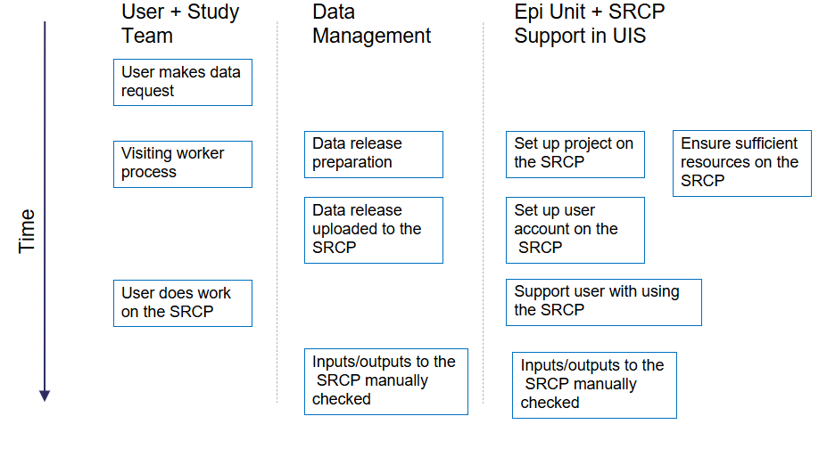
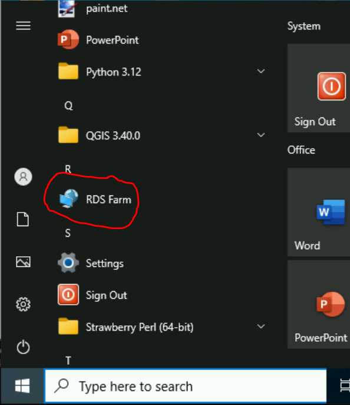
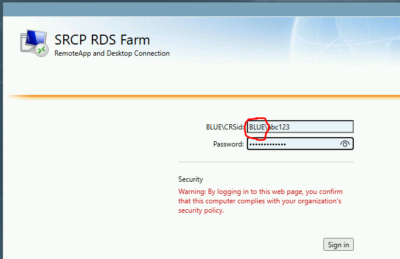
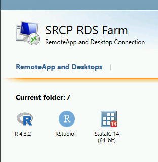
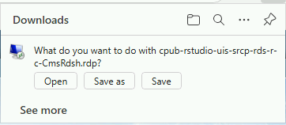
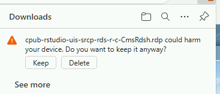
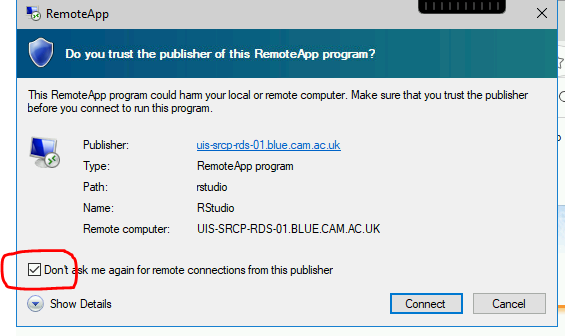
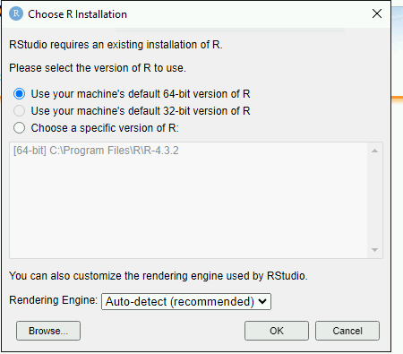

Data management (internal Epidemiology Unit only)
=====================================================

This section is for **Epidemiology Data Managers**, not for collaborators using the SRCP for their analyses.

Overview
--------

Epidemiology Data Managers are responsible for the following tasks:

1. **Project Setup:** Creating new projects as needed in response to data requests. Each project includes a dedicated folder within ``/srv/projects`` and a resource account/partition specifying available computational resources.
2. **User Account Management:** Setting up SRCP accounts for users.
3. **Data Request Import:** Importing study data into the SRCP as requested by users.
4. **Folder and Permissions Management:** Organising project folders and configuring appropriate permissions for study data.
5. **Managing File Transfers:** Moving files between users’ triage (“upload” and “download”) folders and their project folders, such as importing code or exporting results.
6. **Data and Code Review:** Reviewing all data and code entering or leaving the SRCP to ensure compliance and prevent unauthorised content.

Summary of set up process
~~~~~~~~~~~~~~~~~~~~~~~~~
The following diagram gives an overview of what needs to be done to get a user up and running on the SRCP.

Prerequisites
-------------

To perform the data management tasks, the Data Manager needs to:

1. Understand how to :ref:`log into the SRCP<login-later>`
2. Be able to start a :ref:`remote desktop session on SRCP<remote-desktop>` - Data Managers should use the **root** account and **managers** partition
3. Set up an :ref:`SFTP client<SFTP-client>`

Setting up projects
-------------------
To set up a project on the SRCP, the following information is needed:

1. The approved data request (e.g. for EPIC Norfolk this is the EPIC Norfolk Data Request Form) and associated reference number
2. Folder name in the format ``year_month_initials_ENDRnumber`` e.g. 2024_10_TB_ENDR123_2024
3. Hardware requirements for the core limit and storage for the project
4. Which node should the project be assigned to

Specifying the hardware needs some judgement. During the Visiting Worker process the user can specify any requirements for more resources such as additional cores for work with large genetic data sets. As standard we offer 3 cores per user and a total of 200GB of storage, and this can be changed later if required. Extra hardware has additional charges to cover our costs. The project is assigned to a particular node, which is a piece of hardware, with the objective of trying to keep a balanced allocation of projects across nodes. Current assignments can be seen with the following command:

.. code-block:: console

   $ sinfo -O Partition,MaxCPUsperNode,Nodelist --sort Nodelist

This code snippet is available in ``/srv/shared/scripts/slurm.txt`` (to save having to retype it - copy and paste is disabled). Alternatively these allocations are captured on the Hardware tab in the coreLimitProject column of this `spreadsheet <https://universityofcambridgecloud-my.sharepoint.com/:x:/r/personal/trpb2_cam_ac_uk/Documents/SRCP%20project%20and%20user%20information.xlsx?d=w1ecb80016e454672ad51ca7c566c6662&csf=1&web=1&e=mCANbP>`__ . Note that a core limit is the maxmimum that can be used by a project rather than per user. GPU nodes have to be set up on a case by case basis and are very expensive - the RCS team can supply more information. Storage is relatively cheap, around £115 per TB per year, so it is probably not necessary to charge extra unless whole Terrabytes are requested. The overall allocation is tracked on the same spreadsheet as above, under the Theoretical Max column. Again, most projects use well under their allocation so we don't actually have enough storage to accommodate the theoretical maximum.

To request a new project, `this form <https://www.hpc.cam.ac.uk/form/srcp-resource-request>`__ needs to be completed. The following responses are suggested for standard EPIC Norfolk projects but could be changed if needed:

1. Section 1 – SRCP Platform. Select "New project" and "vHPC". For vHPC the platform id is b864dfnfpqj
2. Section 5 – Create a Project. The project name is will be the folder name, the suggested format is ``year_month_initials_ENDRnumber`` where initials are for the person doing the research. The description can be taken from the ENDR form.
3. Section 6 – Project Managers. Select "Yes".
4. Section 7 – Software Requirements. Enter "N/A".
5. Section 8 – vHPC Infrastructure Specification. Leave blank or enter "N/A".
6. Section 10.  Select "Yes".
7. Section 11 – Data Compliance. Enter "N/A - uses data from the existing EPIC Norfolk study.".
8. Section 12 – Data Provider Details. Enter "N/A" for all sections.

You should then receive a confirmation email titled **SRCP Resource Request**. Wait a few more minutes, and then you should get a **new ticket** from RCS support with a title like **HPCSSUP-123456 SRCP Resource Request**. Reply to this email with a copy of the data request form (required by Victoria Hollamby who is the Clinical School Research Governance Advisor).

Billing
-------
We are charged for using the SRCP by RCS:
1. vHPC (Linux) - we are billed for the whole platform on March 16th each year. Projects can start at any time and are pro-rated in that first billing period. Once a project is >1 year in duration, we can then cancel it at any time and again pro rate it at the next billing date.
2. Windows - as we are not platform managers, each project is billed separately. They must still be >1 year duration.

Setting up the project folder
~~~~~~~~~~~~~~~~~~~~~~~~~~~~~~~~~~~~~~~~~~~~

Before bringing in the data, it is recommended that some additional subfolders are created in the project folder (e.g. ``2023_06_20_Smith_ENDR023_2020``). The project folder can be written to by members of the ``platform-b864dfnfpqj-managers`` group, i.e. Data Managers, but users cannot write to this folder. The data should be stored in a read-only location so that it cannot be changed accidentally - the ``data`` subfolder. This can be created with the command ``$ mkdir data`` and will automatically have the correct read-only permissions for users. Any subfolders or files created in the ``data`` subfolder will also inherit the correct permissions. Users will also need a location to do their work and save results - the ``analysis`` subfolder. The suggested folder structure looks like this:

::

   ├── 2023_06_20_Smith_ENDR023_2020
   │   ├── data
   │   │   ├── files and subfolders in data folder
   │   └── analysis
   │       ├── files and subfolders in analysis folder

The user needs permission to **read, write and execute** in the ``analysis`` folder, which is not set up automatically. The best way to achieve this is with this command:

.. code-block:: console

   $ nfs4_setfacl -a "A:fdg:project-<project-id>-users@hpc.cam.ac.uk:RWX" /srv/projects/<userproject>/analysis

where **<project-id>** is the 11 character alphanumeric identifier (e.g. ck5gh6d3se) and **<userproject>** is the folder name (e.g. ``2023_06_20_Smith_ENDR023_2020``). You can find a template for these permission commands in this location: ``/srv/shared/scripts/permission_setup.txt``. Display it on the screen using ``$ cat /srv/shared/scripts/permission_setup.txt``. Once these permissions are set, subfolders and files created in the ``analysis`` subfolder will inherit the read, write and execute permissions.

.. note::
   If you list the project folder contents (``$ ls -l``) the **<project-id>** is available for copying and pasting - see the image below:

.. figure:: ../../images/project-id.png
   :scale: 70 %
   :alt: Finding a project ID

To check that the permissions have been set correctly, use the following command:

.. code-block:: console

   $ nfs4_getfacl /srv/projects/<userproject>/analysis

and the top (most recent) line should look like this:

.. code-block:: console

   A:fdg:project-<project-id>-users@hpc.cam.ac.uk:rwaDdxtTnNcCoy

Setting up users
----------------
Before a user can be set up, their project has to be set up first as the project details are needed for the application form. To set up a user on the SRCP:

1. The user completes a request form which gets sent to the RCS support team
2. The RCS support team send an email to the Epidemiology Platform Managers asking for the account to be approved
3. The Epidemiology Platform Managers check the request and approve or deny as appropriate
4. The RCS team create the account and send the details to the account owner and Epidemiology Platform Managers
5. Since most users do not check their @cam.ac.uk email account, a follow up email with an offer of extra support is needed

The first email that needs to be sent directs the user to fill in the request form, and can be found in the Email Templates section below. When the user has completed this, the Epidemiology Platform Managers receive an email describing the request. The following things need to be checked before approving:

1. The name and CRSid should match the project id and data request number to make sure the user is being given access to the correct project and data. This can be checked in the `spreadsheet <https://universityofcambridgecloud-my.sharepoint.com/:x:/r/personal/trpb2_cam_ac_uk/Documents/SRCP%20project%20and%20user%20information.xlsx?d=w1ecb80016e454672ad51ca7c566c6662&csf=1&web=1&e=mCANbP>`__ in the Users tab.
2. The requested role should be Project User, so that the correct permissions are given. For example, the user cannot move files out of the triage area.

If these items match up, then the request can be approved. The RCS team will then set up the account and notification will be given that it has been set up. When this has been received, the second email in the Email Templates section below can be sent.

Resource utilisation
---------------------
The SRCP is made up of nodes. The CPU nodes we use have 26 cores available, and we currently have 2 nodes (compute-0 and compute-1). GPU nodes have 24 CPU cores and 1 A100 GPU, and are more expensive. Nodes are paid for on a pro-rated annual basis, and we are not operating a hourly charge model like CSD3. When a project is set up we set a limit on the maximum number of cores that can be requested by each user in that project (note that this is also per node, so if there are 2 nodes, the user has that limit per project per node). For a single user it might be appropriate to set a limit of 3 cores, for example. The limit depends on the project requirements and additional costs can be passed on to the user. RCS support can change the core limits on a queue. The nodes are over allocated in that the sum of the core limits of projects assigned to a node are greater than 26. This is because current experience suggests that it is unlikely that all users will be requesting their maximum at once. Finding the appropriate level of over allocation is more of an art than science, and is work in progress! If the full allocation of cores for a project is already in use (for example if there are 2 users using a queue with a 3 core limit and one user is using both cores) then a request to start a remote desktop session will be queued until a core becomes available. Alternatively, the project core limit may not be reached but all the cores on a nodes might be in uses. Again, the request will be queued until a core is available.

Account and partition for Data Managers
~~~~~~~~~~~~~~~~~~~~~~~~~~~~~~~~~~~~~~~

Data Managers can use a specific queue to avoid blocking users by specifying the **root** account and **managers** partition. For simple tasks like bringing data in or out you will only need 1 core. Some data checking could be more resource intensive and require more cores. If the session does not start immediately then we can request to increase the core limit.

The queueing system is provided by SLURM, and the following commands may be useful. They can be found in `/srv/shared/scripts/slurm.txt`

::

   #Command to show jobs by user, showing which queue, node and how manys cpus they are using
   $ squeue -o "%.7i %.9P %.8j %.8u %.2t %.10M %N %C"
   
   #Information about the nodes - how many CPUs are available and how many are being used
   $ sinfo -o "%n %e %m %a %c %C"
   
   #Show total usage by user
   $ sreport user top start=2023-01-01

Bringing study data into the SRCP
---------------------------------

As summary of the process for bringing study data into the SRCP is:

1. Set up the SFTP connection to the SRCP
2. Navigate to the “upload” triage folder and upload the files
3. Log in to the SRCP web interface
4. Start a remote desktop session
5. Copy (not move) the files from your “upload” triage folder to the required project folder
6. Confirm that an analysis folder has been set up and permissions are set correctly in the project
7. Notify the user
8. Tidy up

Example of uploading a data release using WinSCP
~~~~~~~~~~~~~~~~~~~~~~~~~~~~~~~~~~~~~~~~~~~~~~~~

1.  Connect to the Cambridge VPN or use a computer connected to the Cambridge network

2.  Start WinSCP and where you will be presented with the Login dialogue. Select the session for the SRCP that you :ref:`saved previously<SFTP-client>`, or enter the details if you have not already done this - **data-epi-analysis.srcp.hpc.cam.ac.uk** on port 22 and your CRSid as the username (i.e. the same username you use to log into the SRCP web interface).

.. figure:: ../../images/winscp-prev-login.png
  :scale: 50 %
  :alt: WinSCP log in dialogue

3.  Click the Login button.

4.  Enter your CRS/Raven password (the same as for the SRCP web interface) and then enter a TOTP from your mobile device for 2 factor authentication (the same as for the SRCP web interface)

.. figure:: ../../images/winscp-totp.png
  :scale: 50 %
  :alt: WinSCP TOTP

5.  You should now be connected. The triage upload and download folders on SRCP are shown on the right, and your local machine’s folders on the left. You can transfer files between these locations.

.. figure:: ../../images/winscp-landing.png
  :scale: 50 %
  :alt: WinSCP landing

6.  Locate the data release on your local machine (left side) that you wish to upload. Drag and drop it into the upload folder on the SRCP (right side)

.. figure:: ../../images/winscp-upload.png
  :scale: 50 %
  :alt: WinSCP file upload

7.  Switch to a browser, log into the SRCP and :ref:`start a remote desktop session<remote-desktop>`, use the project ID that corresponds to the user whose data is being worked on

8.  Copy (not move) the data from your ``triage/<yourusername>/upload`` folder to the user’s project ``data`` subfolder:

    1. On the command line:

         .. code-block:: console

             $ cp /srv/data-manager/triage/<yourusername>/upload/<filename> /srv/projects/<userproject>/data

    2. Or from the file manager application (which works in a similar way to Windows File Explorer)

9.  If required, a ``7z`` archive can be unzipped:

      .. code-block:: console

         $ 7zG x myfile.7z

10. If the data are large and a copy is stored elsewhere, delete any copies of the data from your triage folder to save storage space.

Providing users with a copy of large, shared datasets
~~~~~~~~~~~~~~~~~~~~~~~~~~~~~~~~~~~~~~~~~~~~~~~~~~~~~

Some large datasets are held in a shared area that is only accessible for users who need access to them. The intention is to reduce the number of copies of large datasets that have to be brought onto the SRCP. To give users access to these datasets we modify the permissions on the folder and its contents to give read access to a user in a project group. All of these commands can be found in `/srv/shared/scripts/shared_folder_permissions.txt` to reduce the amount of typing needed since copy and paste is not available.

Adding new datasets
^^^^^^^^^^^^^^^^^^^

1. Create a new subfolder in ``/srv/shared/data-management`` and copy the data in
2. At this point, only data managers (members of the ``platform-b864dfnfpqj-managers`` group have access as these permissions are inherited from the parent folder
3. Follow the steps below to give users permission to access the data

Giving access to existing datasets
^^^^^^^^^^^^^^^^^^^^^^^^^^^^^^^^^^
Use the following steps to give access to an existing dataset to all users in a project group:

1. Find the project id for the user's project and the name of the shared folder you wish to give them access to
2. Set recursive, inherrited read and execute permissions for directories: ``$ nfs4_setfacl -R -a "A:dg:project-<project-id>-users@hpc.cam.ac.uk:RX" /srv/shared/data-management/<sharedproject>``
3. Set recursive, inherrited read permissions for files: ``$ nfs4_setfacl -R -a "A:fg:project-<project-id>-users@hpc.cam.ac.uk:R" /srv/shared/data-management/<sharedproject>``
4. The commands above also give execute permissions on existing files which is not ideal. This command tidies this up by finding files and then removing the execute permission: ``$ find /srv/shared/data-management/<sharedproject> -type f -exec nfs4_setfacl -x "A:g:project-<project-id>-users@hpc.cam.ac.uk:rxtncy" {} \;``
5. While it is a low risk of these data being misused, you can ask a colleague to check the permissions on the files and folders if you are unsure that the permissions are correct
6. To help the user find the data, a symlink can be created in their project data folder: ``$ ln -s /srv/shared/data-management/<data_folder> /srv/projects/<project-folder>/data``
7. If you need to remove the symlink use the following command: ``$ rm -i /srv/projects/<project-folder>/data/<symlink>`` (**don't add a slash on the end or the command will not work**)

Removing access to existing datasets
^^^^^^^^^^^^^^^^^^^^^^^^^^^^^^^^^^

To remove the permissions for the group when the project is finished (the -x flag is to remove an entry):

1. Remove directory permissions for file inheritence **note the '-type d'**: ``$ find /srv/shared/data-management/<sharedproject> -type d -exec nfs4_setfacl -x "A:fg:project-<project-id>-users@hpc.cam.ac.uk:rtncy" {} \;``
2. Remove directory permissions for directory inheritence **note the '-type d'**: ``$ find /srv/shared/data-management/<sharedproject> -type d -exec nfs4_setfacl -x "A:dg:project-<project-id>-users@hpc.cam.ac.uk:rxtncy" {} \;``
3. Remove file permissions for file inheritence **note the '-type f'**: ``$ find /srv/shared/data-management/<sharedproject> -type f -exec nfs4_setfacl -x "A:g:project-<project-id>-users@hpc.cam.ac.uk:rtncy" {} \;``

Process for users wishing to bring files into the SRCP
------------------------------------------------------

Users may ask Data Managers to allow them to upload files to the SRCP. This might be to bring in extra data sets or bespoke code that they cannot download from the standard repositories available in the SRCP. If data are being brought in, checks should be made that the user has permission to use the data (if it is not from a public source, for example another study).

A summary of the process for users wishing to bring supplementary data or code into the SRCP is:

1. The user connects to their “upload” triage folder using SFTP and uploads the files.
2. The user `notifies a Data Manager <https://mrc-epid-dmt.atlassian.net/servicedesk/customer/portal/6>`__  of the file names. These should be in the user’s “upload” triage folder - the user should have followed the steps for :ref:`uploading a file via STFP<SFTP-upload>`
3. The Data Manager copies the files to their “download” triage folder on the SRCP
4. The Data Manager connects to the SRCP via SFTP and downloads the files to their local machine.
5. The Data Manager inspects the files and confirms that they contain appropriate data/code (see more details below)
6. On the SRCP, the Data Manager copies (not moves) the files from the user’s “upload” triage folder to the user’s project data folder and notifies the user.
7. The user uses the files that are now available in their project data folder (they may need to copy to their analysis folder to edit).
8. Tidy up

Example of enabling a user to bring files into the SRCP using WinSCP
~~~~~~~~~~~~~~~~~~~~~~~~~~~~~~~~~~~~~~~~~~~~~~~~~~~~~~~~~~~~~~~~

1. After receiving a request to make a user’s uploaded files available, you will need to download the files yourself to check them. The initial step is to copy the files from the user’s “upload” folder to your own “download” folder. Alternatively, you can take local copies on the SRCP and examine the files there.

2. If downloading the files, log into the SRCP and :ref:`start a remote desktop session<remote-desktop>`, use the project ID that corresponds to the user whose data is being worked on

3. Navigate to the user’s triage folder ``/srv/data-manager/triage/<username>/upload`` either on the command line or in File Manager

4. Copy the files from the user’s triage folder ``/srv/data-manager/triage/<username>/upload`` to your own download triage folder ``/srv/data-manager/triage/<yourusername>/download`` either on the command line or in File Manager. **OR** leave the files where they are and inspect them directly on the SRCP.

5. Start WinSCP and log in using the details :ref:`saved previously<SFTP-client>`. Navigate to your download folder and copy the files to a location accessible from your local machine.

.. figure:: ../../images/winscp-download.png
  :scale: 50 %
  :alt: WinSCRP file download

6. Inspect the files - see details below

7. If the files are OK then on the SRCP, copy (not move) the files from the user’s “upload” triage folder to the user’s project data folder either on the command line or in File Manager. Notify the user that the files are ready for use.

8. (If the files are large then delete them from both your own and the user’s triage folder to save space? Or delete them from your local computer? Assume user has a back up on their local computer?)

Process for users wishing to take files off the SRCP
----------------------------------------------------

Users will ask Data Managers to allow them to download files from the SRCP. This is so that they can remove summary results for their research, not for removing data from the SRCP.

A summary of the process for users wishing to download files from SRCP is:

1. The user `notifies a Data Manager <https://mrc-epid-dmt.atlassian.net/servicedesk/customer/portal/6>`__  of the file names they wish to download and their location.
2. The Data Manager copies the files to their “download” triage folder on SRCP **OR** accesses the files directly on SRCP.
3. The Data Manager connects to SRCP via SFTP and downloads the files to their local machine **OR** accesses the files directly on SRCP.
4. The Data Manager inspects the files and confirms that they meet the Disclosure Control Rules (more details below)
5. On SRCP, the Data Manager copies (not moves) the files to the user’s “download” triage folder and notifies the user. You will need to use the option ``--preserve=xattr`` with the ``$ cp``, otherwise the user won't be able to access the files (this copies the NFS permissions too). An example would be ``$ cp -r --preserve=xattr /srv/projects/<project>/<folder> /srv/data-manager/triage/<user>/download``.
6. The user connects to their “download” triage folder using SFTP and :ref:`downloads the files<SFTP-download>`

Example of enabling a user to download files from SRCP using WinSCP
~~~~~~~~~~~~~~~~~~~~~~~~~~~~~~~~~~~~~~~~~~~~~~~~~~~~~~~~~~~~~~~~~~~

1. After receiving a request from a user to make some of their files available for download, you will need to download the files yourself to check them. The initial step is to copy the files from the location specified by the user (e.g. the analysis subfolder in their project folder) to your own “download” folder. Alternatively, you can take local copies on SRCP and examine the files there.

2. If downloading the files, log into SRCP and :ref:`start a remote desktop session<remote-desktop>`, use the project ID that corresponds to the user whose data is being worked on

3. Navigate to the location specified by the user (e.g. the analysis subfolder in their project folder) either on the command line or in File Manager

4. Copy (not move) the files from the location specified by the user to your own download triage folder ``/srv/data-manager/triage/<yourusername>/download`` either on the command line or in File Manager.  **OR** leave the files where they are and inspect them directly on SRCP.

5. Start WinSCP and log in using the details :ref:`saved previously<SFTP-client>`. Navigate to your download folder and copy the files to a location accessible from your local machine. **OR** leave the files where they are and inspect them directly on SRCP.

.. figure:: ../../images/winscp-download.png
  :scale: 50 %
  :alt: WinSCRP file download

6. Inspect the files - see details below
7. If the files are OK then on SRCP, copy (not move) the files from the the location specified by the user to the user’s “download” triage folder ``/srv/data-manager/triage/<username>/download`` on the command line. To confirm which ``<username>`` is needed, you can use the `University Lookup Service <https://www.lookup.cam.ac.uk/>`__ .  You will need to use the command ``$ cp --preserve=xattr <source> <destination>``, otherwise the user won't be able to access the files (this copies the NFS permissions too). Notify the user that the files are ready for download.

8. (If the files are large then delete them from both your own and the user’s triage folder to save space?  Or delete them from your local computer? Confirm with the user that they have downloaded the files to their local computer?)

Examining items to be taken in or out
-------------------------------------

Inspecting files that are brought into or exported from the SRCP is a critical responsibility for Data Managers. This process plays a key role in safeguarding participant data, maintaining compliance, and protecting the integrity of the research environment. However, it can be challenging to strike the right balance between performing thorough checks and managing the time and effort required.

Some important considerations include:

- **Due Diligence vs. Efficiency:** While it is essential to carefully review each file to ensure it does not contain sensitive information, malware, or unauthorised content, overly detailed inspections can cause unnecessary delays and increase workload.
- **Risk Assessment:** Assess the level of risk associated with each file transfer. Files containing code or data from unfamiliar sources may require more scrutiny than those from well-known, reputable collaborators.
- **Automation and Process Support:** Where possible, use available tools, scripts, and standardised checklists to support the inspection process and reduce manual effort, without compromising on quality.
- **Communication:** Maintain clear communication with users to set expectations around timelines for file approvals and to clarify any uncertainties about file contents or sources.

By keeping these points in mind, Data Managers can help ensure that the inspection process is both effective and efficient, supporting the safe and timely flow of data within the SRCP.

.. note::
   If you want to inspect the files without removing them from SRCP, then you can use tools such as gedit (``$ gedit``), RStudio (run as a module) and Python. For a visual check you might use gedit. In RStudio or Python you could write a script to search for participant IDs or report discrepancies in columns of data (for example, look for a sudden change in the structure of the data that might suggest something hidden).

General Principles
~~~~~~~~~~~~~~~~~~

- All files entering or leaving the SRCP must be checked to prevent unauthorised transfer of sensitive data, code, or software.
- The level of scrutiny should be proportionate to the data type, file size, and context.
- Refer to detailed disclosure guidance such as the `UK Data Service Report <https://ukdataservice.ac.uk/app/uploads/thf_datareport_aw_web.pdf>`__ and `Genomics England Airlock Rules <https://re-docs.genomicsengland.co.uk/airlock_rules/#>`__ but be pragmatic about what can be checked in practice.

Files to be Imported (Bringing Data, Code, and Software In)
~~~~~~~~~~~~~~~~~~~~~~~~~~~~~~~~~~~~~~~~~~~~~~~~~~~~~~~~~~~
Data Files
^^^^^^^^^^
- **Permission Verification:** Confirm the user has the right to use and process the data. Public datasets (e.g. weather data) are usually low risk; sensitive datasets (e.g. patient records) require additional scrutiny and documentation.
- **Appropriateness:** Ensure data is relevant to the approved research and does not violate project or platform policies.

Code and Scripts
^^^^^^^^^^^^^^^^
- **Security Scanning:** Scan code/scripts for malware or vulnerabilities. Use a virus scanner on a secure workstation before transfer.
- **Source Verification:** Check that code comes from reputable repositories or collaborators.
- **Code Understanding:** If you are unsure about the function or appropriateness of code, consider using a Large Language Model (LLM) such as ChatGPT to help interpret, summarise, or highlight potential issues in the code.

Machine Learning Models (e.g. .onnx files)
^^^^^^^^^^^^^^^^^^^^^^^^^^^^^^^^^^^^^^^^^^
- **Model Validation:** For neural network models, use a tool like `Netron <https://netron.app/>`__ to check the file loads correctly and is a valid model. Or you may need to recreate the user's software environment to load and check the model files
- **Check for Embedded Data:** Ensure models do not contain embedded study data or identifiable information.

Containers (e.g. .sif files)
^^^^^^^^^^^^^^^^^^^^^^^^^^^^
The SRCP supports using Apptainer to run containers, usually .sif files. The current best practice is to inspect the structure and contents of the container. The prerequitiste is having Apptainer installed on a VM (you only have to do this once). Then use the following steps:

1.	Put the .sif container file onto the VM
2.	``$ apptainer inspect -d my-container.sif``  - look at the definition file to see the components of the container
3.	``%files`` section is where "data" are defined. It will describe how the container accesses folders on the host and the location of embedded data. We shell into the container by doing ``$ apptainer shell my-container.sif`` Then ``$ cd /location`` and we can look at the actual files bundled with the container.
4.	``From:`` section describes the base image e.g. a plain install of Ubuntu.
5.	 ``%post`` section is where packages are installed during the building of the container. For example it might tell Python to install some packages.
6.	 An LLM might help to process long package lists and flag anything that looks strange.

- **Vulnerability Scanning:** Use scanners like `Grype <https://github.com/anchore/grype>`__ to check for known issues. **note:** Grype will often produce a very large list of vulnerabilities, many of which may not be relevant in the SRCP’s isolated environment. For example, Grype highlights issues that would be critical for an internet-facing web application, but are low risk within the SRCP. Focus your attention on vulnerabilities that could realistically impact the security or functionality of the platform.
- **Virus Scanning:** Optionally run a virus scanner before import.
- **Security Context:** Note that SRCP uses Apptainer and Podman (not Docker). Containers will run with restricted user privileges on the SRCP, reducing risk.
- **Behaviour Monitoring:** Consider using `Falco <https://falco.org/>`__ to monitor for suspicious activity when running containers. However, this is quite a laborious process as you will need to run it on a virtual machine running Docker, and then start the container to see what happens (see the "Try Falco" option on the website)

Files to be Exported (Taking Data and Code Out)
~~~~~~~~~~~~~~~~~~~~~~~~~~~~~~~~~~~~~~~~~~~~~~~
Disclosure Control
^^^^^^^^^^^^^^^^^^
- **Summary Data Only:** Exported files must not contain individual-level study data, only aggregate or summary results. Researchers should mask phenotype counts lower than 10 (e.g. if the results show 3 people have lung cancer, this should be removed). Review `UK Data Service Report <https://ukdataservice.ac.uk/app/uploads/thf_datareport_aw_web.pdf>`__ and `Genomics England Airlock Rules <https://re-docs.genomicsengland.co.uk/airlock_rules/#>`__  for guidance.
- **Participant Identifiers:** Scan for participant/sample IDs; use scripts if files are large.
- **Check code for data:** Sometimes users annotate their code with intermediate results which can also be disclosive
- **Malicious Export Attempts:** Be alert to attempts to evade checks, such as using obfuscated identifiers or exporting disguised data.
- **Minimisation:** Users should request only the minimum necessary data for their research. If a user requests export of a very large number of results, ask them to revise and reduce the scope where possible. For ‘omics datasets or other inherently large result sets, refer to the Genomics England guidance and require users to minimise exported data as much as practical.
- **Description** ask researchers to describe what the files are and why they are needed, with clear labels

Large or Complex Files
^^^^^^^^^^^^^^^^^^^^^^
- **Practical Review:** For very large or numerous files, ask the user to minimise the amount of data that is exported. If detailed checking is impractical, focus checks on high-risk or sensitive data.
- **Subject-Matter Expertise:** Clarify with researchers if you’re unsure about the content, especially for unfamiliar research areas.

Machine Learning Models
^^^^^^^^^^^^^^^^^^^^^^^
This is a complex area, with concerns that these types of models might encode data or make it easy to recreate data that was used for training. Guidance is in development, so as a general rule we should not export machine learning models.

Documentation and Process
^^^^^^^^^^^^^^^^^^^^^^^^^
- **Export Forms:** Require researchers to submit a form detailing the export’s content and relevance to the project.
- **Managing Turnaround Times:** Strive to review export requests promptly to avoid unnecessary delays for users. However, recognise that workload from other responsibilities may impact response times. If a request may be delayed, communicate expected timeframes clearly to users, and set realistic expectations if there are competing priorities.

Additional Tips
~~~~~~~~~~~~~~~

- **Scripted Checks:** Automate ID scans or repetitive checks for large-scale exports.
- **LLM Assistance:** Use Large Language Models (e.g., ChatGPT) to help interpret code, scripts, or complex outputs, especially when expertise is lacking.
- **Communication:** Work closely with users to clarify file contents and expectations. They should help you reconstruct any environment needed to open and inspect files.

Special Note on Containers
~~~~~~~~~~~~~~~~~~~~~~~~~~

Containers allow users to set up complex analysis environments outside the SRCP and then import them for use within the platform. While containers could potentially introduce security risks, such as malware or data breaches, the SRCP mitigates these risks by only supporting Apptainer and Podman (not Docker). These tools ensure containers run with the same restricted privileges as the user, preventing access to unauthorised data or system resources. Additionally, SRCP’s isolation from the internet and the triage-based file transfer process further reduce security risks, as containers cannot download extra content or exfiltrate data. If a container accidentally corrupts a user’s files, these can be restored from offsite backups.

End of life for projects
------------------------
In this section we will detail what to do at the end of a project.
To some extent we will have captured results as they are taken off the SRCP. The code can be given to the user.
There are questions about what to do with large datasets that are hard to regenerate. In some cases, if they do not contain personal information they can be removed and given to the user to look after.

Windows SRCP
------------
We are not the platform manager for the Windows SRCP as it is shared with the Clinical School.

Setting up a Windows SRCP project
~~~~~~~~~~~~~~~~~~~~~~~~~~~~~~~~~~~~~~
To request a new project, `this form <https://www.hpc.cam.ac.uk/form/srcp-resource-request>`__ needs to be completed. The following responses are suggested for standard EPIC Norfolk projects but could be changed if needed:

1. Section 1 – SRCP Platform. Select "New project" and "Windows". The platform id is 6qdw8f4p9t5
2. Section 5 – Create a Project. The project name is will be the folder name, the suggested format is ``year_month_initials_ENDRnumber`` where initials are for the person doing the research. The description can be taken from the ENDR form.
3. Section 6 – Project Managers. Select "No". Although there are only 2 boxes, enter all the data managers here
4. Section 7 – Software Requirements. Enter "RStudio, Python, RDS Farm".
5. Section 10.  Select "Yes".
6. Section 11 – Data Compliance. Enter "N/A - uses data from the existing EPIC Norfolk study.".
7. Section 12 – Data Provider Details. Enter "N/A" for all sections.

You should then receive a confirmation email titled **SRCP Resource Request**. Wait a few more minutes, and then you should get a **new ticket** from RCS support with a title like **HPCSSUP-123456 SRCP Resource Request**. Reply to this email with a copy of the data request form (required by Victoria Hollamby who is the Clinical School Research Governance Advisor). 

After the project is set up
~~~~~~~~~~~~~~~~~~~~~~~~~~~
1. Create the data and analysis folders.
2. Set the permissions (https://docs.hpc.cam.ac.uk/srcp/swd/faq.html#giving-access-to-project-users). Note the pain of having to search for uis-project-<projectid> in a text box that is hard to find (right click properties->security->Add->(type search term) ->Check
3. Read access for data and Modify for analysis
4. Copy the data over
5. Probably request RDS farm access (TBC whether including this request in Section 7 of the project request form will work)

Instructions for accessing RStudio, Stata etc
~~~~~~~~~~~~~~~~~~~~~~~~~~~~~~~~~~~~~~~~~~~~~~~~~~~

These instructions are for RStudio but the process is similar for Stata.
**IMPORTANT** Be sure to save you work in ``X:/<your project folder>/secure-platform/analysis`` and nowhere else, or it will be lost when the session closes.

1. On the start menu, locate RDS Farm and click it:

2. A browser window should open. Enter your credentials, being sure to include BLUE\\ in front of your CRSid, and press sign in:

3. You should now see these short cuts. Click on RStudio:

4. A download should appear. Click Open:

5. Click Keep:

6. Choose "Don't ask me again...." and click Connect:

7. After a while, RStudio should start.
8. Accept the selected version of R to use:

9. Packages cannot be installed by users as the SRCP is isolated from the internet. Email srcp@hpc.cam.ac.uk with the subject "Windows SRCP - R Package request" to have packages installed OR TBC open a request to bring in a packages as a zip file via the airlock

Import and Export with Windows SRCP
~~~~~~~~~~~~~~~~~~~~~~~~~~~~~~~~~~~~~~~~~~~~~~~~~~~
1. Go to:
https://transfer.srcp.hpc.cam.ac.uk/
2. To log in, use your CRSid as the username along with the associated password. Unfortunately this service uses a separate one time passcode system, which you need to set up in the usual way by scanning the QR code with your phone. It is then listed as "Cerberus" in your OTP app for future reference.
3. Once logged in, navigate to the Export or Import folder as appropriate. Then go into the folder for your project, and then the shared folder within that.
4. For Export, select the files required, right click and choose download.
5. For Import, use the green Add Files or Add Folder buttons at the bottom of the screen

Email templates
---------------
After completing VW process - apply for SRCP account
~~~~~~~~~~~~~~~~~~~~~~~~~~~~~~~~~~~~~~~~~~~~~~~~~~~~
Hi <<name>>,

Thank you for your application to access EPIC Norfolk data. The next step is to apply for access to the Secure Research Computing Platform (SRCP) where you will be able to work with the data. Please complete this form:

https://www.hpc.cam.ac.uk/srcp-request-user-access

You will be asked to log in with Raven, this requires your CRSid (<<CRSid>>) and associated password.

On the form, enter the following

   1. **Requested Role** = Project User
   2. **Project ID** = <<project-id>> (NOTE - this project ID is also needed to start sessions on SRCP so please retain it)
   
If you are using a computer connected to the Cambridge University Network then this next step can be skipped. If you are accessing SRCP from an external computer, you can follow these instructions to prepare a connection to the Cambridge VPN while you wait for your SRCP account:

https://help.uis.cam.ac.uk/service/network-services/remote-access/uis-vpn

Please do get in touch if you need assistance with setting up the VPN.
   
Best wishes
<<sender-name>>

SRCP account set up - next steps
~~~~~~~~~~~~~~~~~~~~~~~~~~~~~~~~
The SRCP Data Managers will receive an email from the SRCP support team informing them that an account has been set up for a user. This email is sent to the user's "@cam.ac.uk" address so they probably won't know that their account is ready. Therefore we can forward on the email with the following additional information:

Hi <<name>>,

Your SRCP account is ready. There is a brief introductory video and overview of the SRCP on the documentation homepage: https://srcp-docs.readthedocs.io/ along with more detailed documentation.

If you feel you would like a demonstration of the basic functionality of the SRCP (logging in, starting a remote desktop, running applications etc) we can set up a meeting with you. Otherwise, to use the SRCP you will need to either use a computer connected to the Cambridge University Network, or the Cambridge University VPN.  Instructions for connecting to the VPN are here:

https://help.uis.cam.ac.uk/service/network-services/remote-access/uis-vpn

Then you can proceed with the “Logging in for the first time section” in the documentation:

https://srcp-docs.readthedocs.io/en/latest/00-Logging-in-for-the-First-Time.html

The following details are needed:

* CRSid = <<CRSid>>
* Project identifier = <<project-id>>
* Project folder name = <<project-folder-name>>

Best wishes
<<sender-name>>

Work in progress
----------------

Using the command line
~~~~~~~~~~~~~~~~~~~~~~

Once the remote desktop session is running, the following steps can be followed from a terminal:

**Download**

1. Navigate to the folder specified by the user: ``$ cd /<foldername>``

2. Look in the folder: ``$ ls -la``

3. Copy the file requested by the user to your own triage download folder: ``$ cp <filename> /srv/data-manager/triage/<yourusername>/download``

4. Connect via SFTP and download the file

5. Check the file for individual level data (i.e. the data should be results only *a more rigorous checklist may be developed*)

6. If the file looks OK, copy the file to the user’s triage download location ``$ cp <filename> /srv/data-manager/triage/<username>/download``

7. Either notify the user that the file was copied as requested to their triage download folder and is available via SFTP, or explain what needs to be changed for the file to be acceptable for download.

**Upload**

1. Navigate to the user’s triage folder: ``$ cd /srv/data-manager/triage/<username>/upload`` where ``<username>`` is the CRSid of the user
2. Look in the folder: ``$ ls -la``
3. Copy the file requested by the user to your own triage download folder
4. Connect via SFTP and download the file to your local computer
5. Check the file for **what - malicious code? data that they shouldn’t have - how do we know?**
6. If the file looks OK, copy the file requested by the user to the location required (for example, the user’s project folder): ``$ cp /srv/data-manager/triage/<username>/upload/<filename> /srv/projects/<projectname>`` where ``<projectname>`` is the user’s project
7. Either notify the user that the file was copied and tell them the location, or explain what needs to be changed for the file to be acceptable for upload.

Using file manager
~~~~~~~~~~~~~~~~~~

Once the remote desktop session is running, the following steps can be followed using the file manager application:

**Download**

1. Navigate to the folder specified by the user
2. Look in the folder
3. Copy the file requested by the user to your own triage download folder (``/srv/data-manager/triage/<yourusername>/download``)
4. Connect via SFTP and download the file
5. Check the file for individual level data (i.e. the data should be results only *a more rigorous checklist may be developed*)
6. If the file looks OK, copy the file to the user’s triage download location (``/srv/data-manager/triage/<username>/download`` where ``<username>`` is the CRSid of the user)
7. Either notify the user that the file was copied as requested to their triage download folder and is available via SFTP, or explain what needs to be changed for the file to be acceptable for download.

**Upload**
1. Navigate to the user’s triage folder: n``/srv/data-manager/triage/<username>/upload`` where ``<username>`` is nthe CRSid of the user
2. Look in the folder
3. Copy the file requested by the user to your own triage download folder
4. Connect via SFTP and download the file to your local computer
5. Check the file for **what - malicious code? data that they shouldn’t have - how do we know?**
6. If the file looks OK, copy the file requested by the user to the location required (for example, the user’s project folder) ``/srv/projects/<projectname>`` where ``<projectname>`` is the user’s project
7. Either notify the user that the file was copied and tell them the location, or explain what needs to be changed for the file to be acceptable for upload.

Notes on project permissions
----------------------------

The platform manager group can rwx on folders and files created in project folders by any other platform - controlled by NFS ACL. The children of the project folder inherit the permissions.

When the platform manager creates the data/analysis folders, they apply ACL permissions to these which are inherited by the items created in these folders.

Draft considerations for whitelisting sites
-------------------------------------------

Ideally users should not have access to any external locations outside of the SRCP to avoid the risk of data being taken out (either on purpose or accidentally) without it first undergoing checks to ensure it doesn't container personal information. Without these restrictions users could easily remove files, for example by uploading them to Google Drive. Other sites that could have a legitimate use can allow data to leave, for example Github. There is a route for bringing files in and out of the SRCP where they are checked by a Data Manager.

However, a balance may be struck where access to certain locations may reduce the amount of checking (and hence increase speed of ingress) while not significantly increase the risk of data being removed from the SRCP without being checked. In these risk-assessed cases, we refer to the location being white-listed. A specific example is the CRAN (Comprehensive R Archive Network) hosted by Bristol University. The CRAN is a network of ftp and web servers around the world that store identical, up-to-date, versions of code and documentation for R. Access to the CRAN allows users to install a vast range of statistical packages that are frequently used in science. Therefore it is convenient to allow users to install R packages from the CRAN themselves, rather than having to wait for a Data Manager to import a package archive and having a more complicated installation. CRAN sites don't host the mechanism for submitting new packages, thus there is no route to be able to push data to the CRAN. New packages are created by submitting code for peer review, which also reduces the chances of malicious content appearing on the CRAN.

Conversely, pypi.org, which hosts Python packages that can be downloaded with Pip, allows users to upload new packages. Therefore even though this location might be useful for users wanting to download packages themselves, it is blocked to avoid data being taken out in packages. Often Python packages can be obtained via Conda, which does provide the ability to upload.

If users have complex software requirements but a location can't be whitelisted, an option is for them to build their environment in a container outside of the SRCP. For example, they may require a package that has a large number of dependencies, making it impractial for a Data Manager to bring them in manually. This gives the flexibility to install whatever is required, before the container is scanned and brought into the SRCP. 

Note that the whitelisting is done by IP address rather than domain name. Care is needed because if two domains point to the same IP address, if one domain is whitelisted, the IP address can be accessed (this was the case with pypi.org and pythonhosted.org).

A set of considerations for whether a location should be whitelisted might include:

1. How many users need access to the location? If it is a small number for a finite project, access could be given for the duration of the project and then removed. Equally if only a few users require it, a manual approach might be possible.
2. Can you find a way to upload data to the location? For example if you can submit your own package. Note that often APIs offer an upload method, but this actual returns a separate cloud storage location (e.g. on AWS) where the file should be uploaded to. Thus since AWS blocked, an upload is not actually possible.
3. Could the environment be built in a container and brought into SRCP after scanning?
4. How trustworthy is the location? If it hosts packages, do they undergo peer review which would give some reassurance that malicious code might not be hidden in a package?

