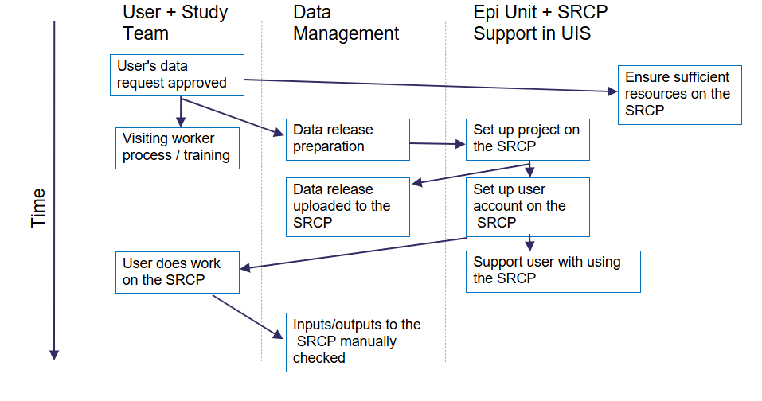

Data management (internal Epidemiology Unit only)
=====================================================

This section is for **Epidemiology Data Managers**, not for collaborators using the SRCP for their analyses.

Overview
--------

Data Managers are responsible for:

1. Setting up projects (if needed) for a data request. A project provides a folder in the `/srv/projects` folder and a resource account/partition which defines what computation resources are available
2. Setting up SRCP accounts for users.
3. Bringing study data requested by the user into the SRCP
4. Creating folders within the project and setting permissions for the study data
5. Moving data between the “upload” and “download” triage folders and a user’s project folder (e.g. bringing code in or results out)
6. Checking data/code that is brought in or out of the SRCP to make sure it does not contain anything it shouldn't

Summary of set up process
~~~~~~~~~~~~~~~~~~~~~~~~~
The following diagram gives an overview of what needs to be done to get a user up and running on the SRCP.

Prerequisites
-------------

To perform the data management tasks, the Data Manager needs to:

1. Understand how to :ref:`log into the SRCP<login-later>`
2. Be able to start a :ref:`remote desktop session on SRCP<remote-desktop>` - Data Managers should use the root account and managers partition
3. Set up an :ref:`SFTP client<SFTP-client>`

Setting up projects
-------------------
To set up a project on the SRCP, the following information is needed:

1. The approved data request (e.g. for EPIC Norfolk this is the EPIC Norfolk Data Request Form) and associated reference number
2. Folder name in the format year_month_initials_ENDRnumber e.g. 2024_10_TB_ENDR123_2024
3. Hardware requirements for the core limit and storage for the project
4. Which node should the project be assigned to

Specifying the hardware needs some judgement. During the Visiting Worker process the user can specify any requirements for more resources such as additional cores for work with large genetic data sets. As standard we offer 3 cores per user and a total of 200GB of storage, and this can be changed later if required. Extra hardware has additional charges to cover our costs. The project is assigned to a particular node, which is a piece of hardware, with the objective of trying to keep a balanced allocation of projects across nodes. Current assignments can be seen with the following command:

.. code-block:: console

   $ sinfo -O Partition,MaxCPUsperNode,Nodelist --sort Nodelist

This code snippet is available in ``/srv/shared/scripts/slurm.txt`` (to save having to retype it). Alternatively these allocations are captured on the Hardware tab in the coreLimitProject column of this `spreadsheet <https://universityofcambridgecloud-my.sharepoint.com/:x:/r/personal/trpb2_cam_ac_uk/Documents/SRCP%20project%20and%20user%20information.xlsx?d=w1ecb80016e454672ad51ca7c566c6662&csf=1&web=1&e=mCANbP>`__ . Note that a core limit is the maxmimum that can be used by a project rather than per user. GPU nodes have to be set up on a case by case basis and are very expensive - the RCS team can supply more information. Storage is relatively cheap, around £115 per TB per year, so it is probably not necessary to charge extra unless whole Terrabytes are requested. The overall allocation is tracked on the same spreadsheet as above, under the Theoretical Max column. Again, most projects use well under their allocation so we don't actually have enough storage to accommodate the theoretical maximum.

To request a new project, `this form <https://www.hpc.cam.ac.uk/form/srcp-resource-request>`__ needs to be completed. The following responses are suggested for standard EPIC Norfolk projects but could be changed if needed:

1. Section 1 – SRCP Platform. Select "New project" and "vHPC" (or "Windows"). For vHPC the platform id is b864dfnfpqj
2. Section 5 – Create a Project. The project name is will be the folder name, the suggested format is ``year_month_initials_ENDRnumber`` where initials are for the person doing the research. The description can be taken from the ENDR form.
3. Section 6 – Project Managers. Select "Yes".
4. Section 7 – Software Requirements. Enter "N/A".
5. Section 8 – vHPC Infrastructure Specification. Leave blank or enter "N/A".
6. Section 10.  Select "Yes".
7. Section 11 – Data Compliance. Enter "N/A - uses data from the existing EPIC Norfolk study.".
8. Section 12 – Data Provider Details. Enter "N/A" for all sections.

Additionally a copy of the data request form is required by Victoria Hollamby (vph20@medschl.cam.ac.uk) who is the Clinical School Research Governance Advisor. At the time of writing, the submitted form is passed to her, and the data request has to be sent to her via email.

Setting up the project folder
~~~~~~~~~~~~~~~~~~~~~~~~~~~~~~~~~~~~~~~~~~~~

Before bringing in the data, it is recommended that some additional subfolders are created in the project folder (e.g. ``2023_06_20_Smith_ENDR023_2020``). The project folder can be written to by members of the ``platform-b864dfnfpqj-managers`` group, i.e. Data Managers, but users cannot write to this folder. The data should be stored in a read-only location so that it cannot be changed accidentally - the ``data`` subfolder. This can be created with the command ``$ mkdir data`` and will automatically have the correct read-only permissions for users. Any subfolders or files created in the ``data`` subfolder will also inherit the correct permissions. Users will also need a location to do their work and save results - the ``analysis`` subfolder. The suggested folder structure looks like this:

::

   ├── 2023_06_20_Smith_ENDR023_2020
   │   ├── data
   │   │   ├── files and subfolders in data folder
   │   └── analysis
   │       ├── files and subfolders in analysis folder

The user needs permission to **read, write and execute** in the ``analysis`` folder, which is not set up automatically. The best way to achieve this is with this command:

.. code-block:: console

   $ nfs4_setfacl -a "A:fdg:project-<project-id>-users@hpc.cam.ac.uk:RWX" /srv/projects/<userproject>/analysis

where **<project-id>** is the 11 character alphanumeric identifier (e.g. ck5gh6d3se) and **<userproject>** is the folder name (e.g. ``2023_06_20_Smith_ENDR023_2020``). You can find a template for these permission commands in this location: ``/srv/shared/scripts/permission_setup.txt``. Display it on the screen using ``$ cat /srv/shared/scripts/permission_setup.txt``. Once these permissions are set, subfolders and files created in the ``analysis`` subfolder will inherit the read, write and execute permissions.

.. note::
   If you list the project folder contents (``$ ls -l``) the **<project-id>** is available for copying and pasting - see the image below:

To check that the permissions have been set correctly, use the following command:

.. code-block:: console

   $ nfs4_getfacl /srv/projects/<userproject>/analysis

and the top (most recent) line should look like this:

.. code-block:: console

   A:fdg:project-<project-id>-users@hpc.cam.ac.uk:rwaDdxtTnNcCoy

Setting up users
----------------
Before a user can be set up, their project has to be set up first as the project details are needed for the application form. To set up a user on the SRCP:

1. The user completes a request form which gets sent to the RCS support team
2. The RCS support team send an email to the Epidemiology Platform Managers asking for the account to be approved
3. The Epidemiology Platform Managers check the request and approve or deny as appropriate
4. The RCS team create the account and send the details to the account owner and Epidemiology Platform Managers
5. Since most users do not check their @cam.ac.uk email account, a follow up email with an offer of extra support is needed

The first email that needs to be sent directs the user to fill in the request form, and can be found in the Email Templates section below. When the user has completed this, the Epidemiology Platform Managers receive an email describing the request. The following things need to be checked before approving:

1. The name and CRSid should match the project id and data request number to make sure the user is being given access to the correct project and data. This can be checked in the `spreadsheet <https://universityofcambridgecloud-my.sharepoint.com/:x:/r/personal/trpb2_cam_ac_uk/Documents/SRCP%20project%20and%20user%20information.xlsx?d=w1ecb80016e454672ad51ca7c566c6662&csf=1&web=1&e=mCANbP>`__ in the Users tab.
2. The requested role should be Project User, so that the correct permissions are given. For example, the user cannot move files out of the triage area.

If these items match up, then the request can be approved. The RCS team will then set up the account and notification will be given that it has been set up. When this has been received, the second email in the Email Templates section below can be sent.

Resource utilisation
---------------------
The SRCP is made up of nodes. The CPU nodes we use have 20 cores available, and we currently have 2 nodes (compute-0 and compute-1). GPU nodes have 24 CPU cores and 1 A100 GPU, and are more expensive. Nodes are paid for on a pro-rated annual basis, and we are not operating a hourly charge model like CSD3. When a project is set up we set a limit on the maximum number of cores that can be used by that project. For a single user it might be appropriate to set a limit of 2 cores, for example. The limit depends on the project requirements and additional costs can be passed on to the user. RCS support can change the core limits on a queue. The nodes are over allocated in that the sum of the core limits of projects assigned to a node are greater than 20. This is because current experience suggests that it is unlikely that all users will be requesting their maximum at once. Finding the appropriate level of over allocation is more of an art than science, and is work in progress! If the full allocation of cores for a project is already in use (for example if there are 2 users using a queue with a 2 core limit and one user is using both cores) then a request to start a remote desktop session will be queued until a core becomes available. Alternatively, the project core limit may not be reached but all the cores on a nodes might be in uses. Again, the request will be queued until a core is available.

Account and partition for Data Managers
~~~~~~~~~~~~~~~~~~~~~~~~~~~~~~~~~~~~~~~

Data Managers can use a specific queue to avoid blocking users by specifying the **root** account and **managers** partition. For simple tasks like bringing data in or out you will only need 1 core. Some data checking could be more resource intensive and require more cores. If the session does not start immediately then we can request to increase the core limit.

The queueing system is provided by SLURM, and the following commands may be useful. They can be found in `/srv/shared/scripts/slurm.txt`

::

   #Command to show jobs by user, showing which queue, node and how manys cpus they are using
   $ squeue -o "%.7i %.9P %.8j %.8u %.2t %.10M %N %C"
   
   #Information about the nodes - how many CPUs are available and how many are being used
   $ sinfo -o "%n %e %m %a %c %C"
   
   #Show total usage by user
   $ sreport user top start=2023-01-01

Bringing study data into the SRCP
---------------------------------

As summary of the process for bringing study data into the SRCP is:

1. Set up the SFTP connection to the SRCP
2. Navigate to the “upload” triage folder and upload the files
3. Log in to the SRCP web interface
4. Start a remote desktop session
5. Copy (not move) the files from your “upload” triage folder to the required project folder
6. Confirm that an analysis folder has been set up and permissions are set correctly in the project
7. Notify the user
8. Tidy up

Example of uploading a data release using WinSCP
~~~~~~~~~~~~~~~~~~~~~~~~~~~~~~~~~~~~~~~~~~~~~~~~

1.  Connect to the Cambridge VPN or use a computer connected to the Cambridge network

2.  Start WinSCP and where you will be presented with the Login dialogue. Select the session for the SRCP that you :ref:`saved previously<SFTP-client>`, or enter the details if you have not already done this - **data-epi-analysis.srcp.hpc.cam.ac.uk** on port 22 and your CRSid as the username (i.e. the same username you use to log into the SRCP web interface).

3.  Click the Login button.

4.  Enter your CRS/Raven password (the same as for the SRCP web interface) and then enter a TOTP from your mobile device for 2 factor authentication (the same as for the SRCP web interface)

.. figure:: ../../images/winscp-totp.png
  :scale: 50 %
  :alt: WinSCP TOTP

5.  You should now be connected. The triage upload and download folders on SRCP are shown on the right, and your local machine’s folders on the left. You can transfer files between these locations.

.. figure:: ../../images/winscp-landing.png
  :scale: 50 %
  :alt: WinSCP landing

6.  Locate the data release on your local machine (left side) that you wish to upload. Drag and drop it into the upload folder on the SRCP (right side)

.. figure:: ../../images/winscp-upload.png
  :scale: 50 %
  :alt: WinSCP file upload

7.  Switch to a browser, log into the SRCP and :ref:`start a remote desktop session<remote-desktop>`, use the project ID that corresponds to the user whose data is being worked on

8.  Copy (not move) the data from your ``triage/<yourusername>/upload`` folder to the user’s project ``data`` subfolder:

    1. On the command line:

         .. code-block:: console

             $ cp /srv/data-manager/triage/<yourusername>/upload/<filename> /srv/projects/<userproject>/data

    2. Or from the file manager application (which works in a similar way to Windows File Explorer)

9.  If required, a ``7z`` archive can be unzipped:

      .. code-block:: console

         $ 7zG x myfile.7z

10. If the data are large and a copy is stored elsewhere, delete any copies of the data from your triage folder to save storage space.

Providing users with a copy of large, shared datasets
~~~~~~~~~~~~~~~~~~~~~~~~~~~~~~~~~~~~~~~~~~~~~~~~~~~~~

Some large datasets are held in a shared area that is only accessible for users who need access to them. The intention is to reduce the number of copies of large datasets that have to be brought onto the SRCP. To give users access to these datasets we modify the permissions on the folder and its contents to give read access to a user in a project group.

1. Create a new subfolder in ``/srv/shared/data-management`` (but do not copy the data in at this stage)
2. ``$ nfs4_setfacl -R -a "A:dg:project-<project-id>-users@hpc.cam.ac.uk:RX" srv/shared/data-management/<sharedproject>``
3. ``$ nfs4_setfacl -R -a "A:fg:project-<project-id>-users@hpc.cam.ac.uk:R" srv/shared/data-management/<sharedproject>``
4. The commands above will mean that new files and folders added will also have the correct permissions. Now you can copy the data into the subfolder create in #1.
5. If files and folders already exist, then the commands in #2 and #3 also give execute permissions on existing files which is not ideal. This command tidies this up by finding files and then removing the execute permission: ``$ find srv/shared/data-management/<sharedproject> -type f -exec nfs4_setfacl -x "A:g:project-<project-id>-users@hpc.cam.ac.uk:rxtncy" {} \;``
6. While it is a low risk of these data being misused, you can ask a colleague to check the permissions on the files and folders if you are unsure that the permissions are correct.

To help the user find the data, a symlink can be created in their home folder: ``$ ln -s /srv/shared/data-management/<data_folder> /srv/home/<user>``
If you need to remove the symlink user the following command: ``$ rm -i /srv/home/<user>/<symlink>``

To remove the permissions for the group when the project is finished:

1. Remove directory permissions for file inheritence **note the '-type d'**: ``$ find srv/shared/data-management/<sharedproject> -type d -exec nfs4_setfacl -x "A:fg:project-<project-id>-users@hpc.cam.ac.uk:rtncy" {} \;``
2. Remove directory permissions for directory inheritence **note the '-type d'**: ``$ find srv/shared/data-management/<sharedproject> -type d -exec nfs4_setfacl -x "A:dg:project-<project-id>-users@hpc.cam.ac.uk:rxtncy" {} \;``
3. Remove file permissions for file inheritence **note the '-type f'**: ``$ find srv/shared/data-management/<sharedproject> -type f -exec nfs4_setfacl -x "A:g:project-<project-id>-users@hpc.cam.ac.uk:rtncy" {} \;``

Process for users wishing to bring files into the SRCP
------------------------------------------------------

Users may ask Data Managers to allow them to upload files to the SRCP. This might be to bring in extra data sets or bespoke code that they cannot download from the standard repositories available in the SRCP. If data are being brought in, checks should be made that the user has permission to use the data in this way.

A summary of the process for users wishing to bring supplementary data or code into the SRCP is:

1. The user connects to their “upload” triage folder using SFTP and uploads the files.
2. The user notifies a Data Manager (srcpdata@mrc-epid.cam.ac.uk) of the file names. These should be in the user’s “upload” triage folder - the user should have followed the steps for :ref:`uploading a file via STFP<SFTP-upload>`
3. The Data Manager copies the files to their “download” triage folder on the SRCP
4. The Data Manager connects to the SRCP via SFTP and downloads the files to their local machine.
5. The Data Manager inspects the files and confirms that they contain appropriate data/code (see more details in the example below)
6. On the SRCP, the Data Manager copies (not moves) the files from the user’s “upload” triage folder to the user’s project data folder and notifies the user.
7. The user uses the files that are now available in their project data folder (they may need to copy to their analysis folder to edit).
8. Tidy up

Example of enabling a user to bring files into the SRCP using WinSCP
~~~~~~~~~~~~~~~~~~~~~~~~~~~~~~~~~~~~~~~~~~~~~~~~~~~~~~~~~~~~~~~~

1. After receiving a request to make a user’s uploaded files available, you will need to download the files yourself to check them. The initial step is to copy the files from the user’s “upload” folder to your own “download” folder. Alternatively, you can take local copies on the SRCP and examine the files there.

2. If downloading the files, log into the SRCP and :ref:`start a remote desktop session<remote-desktop>`, use the project ID that corresponds to the user whose data is being worked on

3. Navigate to the user’s triage folder ``/srv/data-manager/triage/<username>/upload`` either on the command line or in File Manager

4. Copy the files from the user’s triage folder ``/srv/data-manager/triage/<username>/upload`` to your own download triage folder ``/srv/data-manager/triage/<yourusername>/download`` either on the command line or in File Manager. **OR** leave the files where they are and inspect them directly on the SRCP.

5. Start WinSCP and log in using the details :ref:`saved previously<SFTP-client>`. Navigate to your download folder and copy the files to a location accessible from your local machine.

.. figure:: ../../images/winscp-download.png
  :scale: 50 %
  :alt: WinSCRP file download

6. Inspect the files. **TO CONFIRM** If they contain data confirm that the user has permission to use it (because we don’t want to be seen to enable analyses on data that is not being used correctly). If they are Singularity containers (.sif), run a scanner on them (for example `Grype <https://github.com/anchore/grype>`__). A virus scanner can also be run on the files. Neural network models in .onnx format can be checked with `Netron <https://netron.app/>`__ - i.e. check that the model loads to confirm it is actually a model.

7. If the files are OK then on the SRCP, copy (not move) the files from the user’s “upload” triage folder to the user’s project data folder either on the command line or in File Manager. Notify the user that the files are ready for use.

8. (If the files are large then delete them from both your own and the user’s triage folder to save space? Or delete them from your local computer? Assume user has a back up on their local computer?)

Process for users wishing to take files off the SRCP
----------------------------------------------------

Users will ask Data Managers to allow them to download files from the SRCP. This is so that they can remove summary results for their research, not for removing data from the SRCP.

A summary of the process for users wishing to download files from SRCP is:

1. The user notifies a Data Manager (srcpdata@mrc-epid.cam.ac.uk) of the file names they wish to download and their location.
2. The Data Manager copies the files to their “download” triage folder on SRCP **OR** accesses the files directly on SRCP.
3. The Data Manager connects to SRCP via SFTP and downloads the files to their local machine **OR** accesses the files directly on SRCP.
4. The Data Manager inspects the files and confirms that they meet the Disclosure Control Rules (more details in the example below):

   -  a description of what the file contains, how it was generated and its relevance to the research question is provided
   -  files should only contain aggregated, summary results, not individual values
   -  results are clearly labelled
   -  files should not have any participant or sample IDs
   -  mask phenotype counts lower than 10 (e.g. if the results show 3 people have lung cancer, this should be masked)

5. On SRCP, the Data Manager copies (not moves) the files to the user’s “download” triage folder and notifies the user. You will need to use the option ``--preserve=xattr`` with the ``$ cp``, otherwise the user won't be able to access the files (this copies the NFS permissions too). An example would be ``$ cp -r --preserve=xattr /srv/projects/<project>/<folder> /srv/data-manager/triage/<user>/download``.

6. The user connects to their “download” triage folder using SFTP and :ref:`downloads the files<SFTP-download>`

Example of enabling a user to download files from SRCP using WinSCP
~~~~~~~~~~~~~~~~~~~~~~~~~~~~~~~~~~~~~~~~~~~~~~~~~~~~~~~~~~~~~~~~~~~

1. After receiving a request from a user to make some of their files available for download, you will need to download the files yourself to check them. The initial step is to copy the files from the location specified by the user (e.g. the analysis subfolder in their project folder) to your own “download” folder. Alternatively, you can take local copies on SRCP and examine the files there.

2. If downloading the files, log into SRCP and :ref:`start a remote desktop session<remote-desktop>`, use the project ID that corresponds to the user whose data is being worked on

3. Navigate to the location specified by the user (e.g. the analysis subfolder in their project folder) either on the command line or in File Manager

4. Copy (not move) the files from the location specified by the user to your own download triage folder ``/srv/data-manager/triage/<yourusername>/download`` either on the command line or in File Manager.  **OR** leave the files where they are and inspect them directly on SRCP.

5. Start WinSCP and log in using the details :ref:`saved previously<SFTP-client>`. Navigate to your download folder and copy the files to a location accessible from your local machine. **OR** leave the files where they are and inspect them directly on SRCP.

.. figure:: ../../images/winscp-download.png
  :scale: 50 %
  :alt: WinSCRP file download

6. Inspect the files. The files need to be checked to ensure that they do not contain study data, only summary results. See point 4 above which describes some broad Disclosure Control Rules. More detailed guidance can be found `here <https://ukdataservice.ac.uk/app/uploads/thf_datareport_aw_web.pdf>`__. This guidance is very detailed, so a balance needs to be struck around what level of checking is needed. Neural network models in .onnx format can be checked with `Netron <https://netron.app/>`__ - i.e. check that the model loads to confirm it is actually a model.

.. note::
   If you want to inspect the files without removing them from SRCP, then you can use tools such as gedit (``$ gedit``), RStudio (run as a module) and Python. For a visual check you might use gedit. In RStudio or Python you could write a script to search for participant IDs or report discrepancies in columns of data (for example, look for a sudden change in the structure of the data that might suggest something hidden).

7. If the files are OK then on SRCP, copy (not move) the files from the the location specified by the user to the user’s “download” triage folder ``/srv/data-manager/triage/<username>/download`` on the command line. To confirm which ``<username>`` is needed, you can use the `University Lookup Service <https://www.lookup.cam.ac.uk/>`__ .  You will need to use the command ``$ cp --preserve=xattr``, otherwise the user won't be able to access the files (this copies the NFS permissions too). Notify the user that the files are ready for download.

8. (If the files are large then delete them from both your own and the user’s triage folder to save space?  Or delete them from your local computer? Confirm with the user that they have downloaded the files to their local computer?)

Examining items to be taken in or out
-------------------------------------

Files that are to be taken out from the system should be checked to ensure that they do not contain study data, only summary results. More detailed guidance can be found `here <https://ukdataservice.ac.uk/app/uploads/thf_datareport_aw_web.pdf>`__ and `here <https://re-docs.genomicsengland.co.uk/airlock_rules/#>`__. This guidance is very detailed, so a balance needs to be struck around what level of checking is needed. It can be challenging to check large numbers of files, or files that are very large. Often it is necessary to have some understanding of the research area that the results relate to, which can be difficult for a Data Manager who cannot be expected to be experts in every relevant area of research.

A standard check might be to look for participant IDs in the data export as this is clearly an indicator of individual level data. This prevents the scenario where a user simply asks for the data to be taken out. Sometimes they have misunderstood the purpose of the SRCP and think that this is an appropriate request. You could do this using a script in R or Python if the files are large. First create a list of the participant IDs from the data release, then search for these values in the data export. A more malicious user would possibly not use the participant IDs if there were trying to remove data without being detected.

Often a more formal process is used where researchers have to submit a form with details about what the results are and how they relate to the project. There can be a service level agreement for the time taken to review requests.

For data that is to be brought in, checks should be made about whether the user has permission to use this data and copied it to different locations. Some data sets might not be a concern, for example publicly available data on air pollution. Questions should be raised if a user is trying to bring in something sensitive like patient records.

Users may want to bring in code. This should be scanned to check for security problems.  A virus scanner can be run on the files by downloading to your local machine, right clicking and selecting "Scan for threats".

Neural network models in .onnx format can be checked with `Netron <https://netron.app/>`__ - i.e. check that the model loads to confirm it is actually a model.

Containers
~~~~~~~~~~
Containers are a useful way of users being able to configure complex analysis environments outside of the SRCP, which can be easier than dealing with restrictions inside the SCRP over what repositories can be accessed in order to build the environment. A working container can then be brought into the SRCP via the triage mechanism. Naturally there is concern about whether this could be a route for malicious software to be run on the SRCP, potentially resulting in data loss, data leakage, ransomware, hijacking of resources or attackers gaining access to systems beyond the SRCP. However, these concerns are mitigated by the properties of the SRCP and the software that it provides for running containers.

Docker is a popular tool for running containers. The architecture of Docker means that if containers are not configured and constructed carefully, and are exposed to external users, there is a risk that they provide a way for gaining full control of a system. If this were to occur, a user could then perform the malicious actions described above. The SRCP does not provide Docker, and instead offers Apptainer and Podman for running containers. These are set up in a way so that the containers they run with the same privileges as the user, which are restricted on the SRCP. Therefore the container can only do things that the user could do anyway. For example, they could not access (and hence damage) data that they didn't already have access to, nor could they hijack all the resources on a node.

Another key feature of the SRCP that reduces the scope of bad actors to cause problems is the isolation from the internet. This prevents data from being taken out, because data are only able to leave via the triage system (which requires a data manager to move the data to an externally accessible location). Atackers are not able to connect to the container via a vulnerability because the container is not accessible from the internet. Finally, additional malicious content cannot be downloaded into the SRCP.

If a user were to run a container that unintentionally damaged (or encrypted for ransom) their own files (e.g. analysis code) then these files could be restored from off site snapshots that are taken of the SRCP storage.

Although these features help ensure that running containers won't cause serious issues, here we consider what other precautions are possible. There are 2 areas that can be checked:

1. Check for CVEs (Common Vulnerabilities and Exposures), a list of publicly disclosed computer security flaws in libraries, packages and software. These might be found in the software in the container image.
2. Detecting unexpected behaviour, configuration changes, and attacks when the container is running

The first of these can be checked with a scanner like `Grype <https://github.com/anchore/grype>`__ . The challenge here is to deal with the output of often hundreds of vulnerabilities. Checking all of them is impractical and they might not be relevant if the container is running in an isolated environment. Rather, if the container was running a key piece of software that is externally facing, then these vulnerabilities would be more important.

For checking suspicious behaviour, `Falco <https://falco.org/>`__ can be started before starting the container to be checked. Then Falco will flag up any activity that might indicate something that is not right.

End of life for projects
------------------------
In this section we will detail what to do at the end of a project.
To some extent we will have captured results as they are taken off the SRCP. The code can be given to the user.
There are questions about what to do with large datasets that are hard to regenerate. In some cases, if they do not contain personal information they can be removed and given to the user to look after.

Email templates
---------------
After completing VW process - apply for SRCP account
~~~~~~~~~~~~~~~~~~~~~~~~~~~~~~~~~~~~~~~~~~~~~~~~~~~~
Hi <<name>>,

Thank you for your application to access EPIC Norfolk data. The next step is to apply for access to the Secure Research Computing Platform (SRCP) where you will be able to work with the data. Please complete this form:

https://www.hpc.cam.ac.uk/srcp-request-user-access

You will be asked to log in with Raven, this requires your CRSid (<<CRSid>>) and associated password.

On the form, enter the following

   1. **Requested Role** = Project User
   2. **Project ID** = <<project-id>> (NOTE - this project ID is also needed to start sessions on SRCP so please retain it)
   
If you are using a computer connected to the Cambridge University Network then this next step can be skipped. If you are accessing SRCP from an external computer, you can follow these instructions to prepare a connection to the Cambridge VPN while you wait for your SRCP account:

https://help.uis.cam.ac.uk/service/network-services/remote-access/uis-vpn

Please do get in touch if you need assistance with setting up the VPN.
   
Best wishes
<<sender-name>>

SRCP account set up - next steps
~~~~~~~~~~~~~~~~~~~~~~~~~~~~~~~~
The SRCP Data Managers will receive an email from the SRCP support team informing them that an account has been set up for a user. This email is sent to the user's "@cam.ac.uk" address so they probably won't know that their account is ready. Therefore we can forward on the email with the following additional information:

Hi <<name>>,

Your SRCP account is ready. There is a brief introductory video and overview of the SRCP on the documentation homepage: https://srcp-docs.readthedocs.io/ along with more detailed documentation.

If you feel you would like a demonstration of the basic functionality of the SRCP (logging in, starting a remote desktop, running applications etc) we can set up a meeting with you. Otherwise, to use the SRCP you will need to either use a computer connected to the Cambridge University Network, or the Cambridge University VPN.  Instructions for connecting to the VPN are here:

https://help.uis.cam.ac.uk/service/network-services/remote-access/uis-vpn

Then you can proceed with the “Logging in for the first time section” in the documentation:

https://srcp-docs.readthedocs.io/en/latest/00-Logging-in-for-the-First-Time.html

The following details are needed:

* CRSid = <<CRSid>>
* Project identifier = <<project-id>>
* Project folder name = <<project-folder-name>>

Best wishes
<<sender-name>>

Work in progress
----------------

Using the command line
~~~~~~~~~~~~~~~~~~~~~~

Once the remote desktop session is running, the following steps can be followed from a terminal:

**Download**

1. Navigate to the folder specified by the user: ``$ cd /<foldername>``

2. Look in the folder: ``$ ls -la``

3. Copy the file requested by the user to your own triage download folder: ``$ cp <filename> /srv/data-manager/triage/<yourusername>/download``

4. Connect via SFTP and download the file

5. Check the file for individual level data (i.e. the data should be results only *a more rigorous checklist may be developed*)

6. If the file looks OK, copy the file to the user’s triage download location ``$ cp <filename> /srv/data-manager/triage/<username>/download``

7. Either notify the user that the file was copied as requested to their triage download folder and is available via SFTP, or explain what needs to be changed for the file to be acceptable for download.

**Upload**

1. Navigate to the user’s triage folder: ``$ cd /srv/data-manager/triage/<username>/upload`` where ``<username>`` is the CRSid of the user
2. Look in the folder: ``$ ls -la``
3. Copy the file requested by the user to your own triage download folder
4. Connect via SFTP and download the file to your local computer
5. Check the file for **what - malicious code? data that they shouldn’t have - how do we know?**
6. If the file looks OK, copy the file requested by the user to the location required (for example, the user’s project folder): ``$ cp /srv/data-manager/triage/<username>/upload/<filename> /srv/projects/<projectname>`` where ``<projectname>`` is the user’s project
7. Either notify the user that the file was copied and tell them the location, or explain what needs to be changed for the file to be acceptable for upload.

Using file manager
~~~~~~~~~~~~~~~~~~

Once the remote desktop session is running, the following steps can be followed using the file manager application:

**Download**

1. Navigate to the folder specified by the user
2. Look in the folder
3. Copy the file requested by the user to your own triage download folder (``/srv/data-manager/triage/<yourusername>/download``)
4. Connect via SFTP and download the file
5. Check the file for individual level data (i.e. the data should be results only *a more rigorous checklist may be developed*)
6. If the file looks OK, copy the file to the user’s triage download location (``/srv/data-manager/triage/<username>/download`` where ``<username>`` is the CRSid of the user)
7. Either notify the user that the file was copied as requested to their triage download folder and is available via SFTP, or explain what needs to be changed for the file to be acceptable for download.

**Upload**
1. Navigate to the user’s triage folder: n``/srv/data-manager/triage/<username>/upload`` where ``<username>`` is nthe CRSid of the user
2. Look in the folder
3. Copy the file requested by the user to your own triage download folder
4. Connect via SFTP and download the file to your local computer
5. Check the file for **what - malicious code? data that they shouldn’t have - how do we know?**
6. If the file looks OK, copy the file requested by the user to the location required (for example, the user’s project folder) ``/srv/projects/<projectname>`` where ``<projectname>`` is the user’s project
7. Either notify the user that the file was copied and tell them the location, or explain what needs to be changed for the file to be acceptable for upload.

Notes on project permissions
----------------------------

The platform manager group can rwx on folders and files created in project folders by any other platform - controlled by NFS ACL. The children of the project folder inherit the permissions.

When the platform manager creates the data/analysis folders, they apply ACL permissions to these which are inherited by the items created in these folders.

Draft considerations for whitelisting sites
-------------------------------------------

Ideally users should not have access to any external locations outside of the SRCP to avoid the risk of data being taken out (either on purpose or accidentally) without it first undergoing checks to ensure it doesn't container personal information. Without these restrictions users could easily remove files, for example by uploading them to Google Drive. Other sites that could have a legitimate use can allow data to leave, for example Github. There is a route for bringing files in and out of the SRCP where they are checked by a Data Manager.

However, a balance may be struck where access to certain locations may reduce the amount of checking (and hence increase speed of ingress) while not significantly increase the risk of data being removed from the SRCP without being checked. In these risk-assessed cases, we refer to the location being white-listed. A specific example is the CRAN (Comprehensive R Archive Network) hosted by Bristol University. The CRAN is a network of ftp and web servers around the world that store identical, up-to-date, versions of code and documentation for R. Access to the CRAN allows users to install a vast range of statistical packages that are frequently used in science. Therefore it is convenient to allow users to install R packages from the CRAN themselves, rather than having to wait for a Data Manager to import a package archive and having a more complicated installation. CRAN sites don't host the mechanism for submitting new packages, thus there is no route to be able to push data to the CRAN. New packages are created by submitting code for peer review, which also reduces the chances of malicious content appearing on the CRAN.

Conversely, pypi.org, which hosts Python packages that can be downloaded with Pip, allows users to upload new packages. Therefore even though this location might be useful for users wanting to download packages themselves, it is blocked to avoid data being taken out in packages. Often Python packages can be obtained via Conda, which does provide the ability to upload.

If users have complex software requirements but a location can't be whitelisted, an option is for them to build their environment in a container outside of the SRCP. For example, they may require a package that has a large number of dependencies, making it impractial for a Data Manager to bring them in manually. This gives the flexibility to install whatever is required, before the container is scanned and brought into the SRCP. 

Note that the whitelisting is done by IP address rather than domain name. Care is needed because if two domains point to the same IP address, if one domain is whitelisted, the IP address can be accessed (this was the case with pypi.org and pythonhosted.org).

A set of considerations for whether a location should be whitelisted might include:

1. How many users need access to the location? If it is a small number for a finite project, access could be given for the duration of the project and then removed. Equally if only a few users require it, a manual approach might be possible.
2. Can you find a way to upload data to the location? For example if you can submit your own package. Note that often APIs offer an upload method, but this actual returns a separate cloud storage location (e.g. on AWS) where the file should be uploaded to. Thus since AWS blocked, an upload is not actually possible.
3. Could the environment be built in a container and brought into SRCP after scanning?
4. How trustworthy is the location? If it hosts packages, do they undergo peer review which would give some reassurance that malicious code might not be hidden in a package?

