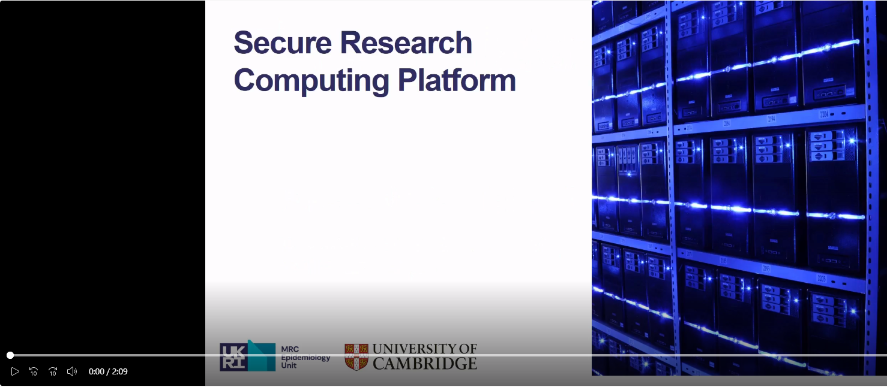

Overview
========

This wiki provides a guide for the users of the Epidemiology Secure Research Computing Platform (SRCP).

SRCP is a platform provided by the University of Cambridge `Research Computing Service <https://docs.hpc.cam.ac.uk/srcp/index.html>`__. It allows researchers to access valuable datasets for research, similar to a secure reference library. Rather than extracts of individual level data being ‘released,’ SRCP provides access to a secure analytics environment so researchers bring analysis to the data. Results are checked before being removed from the platform to make sure sensitive data is not being removed.

SRCP is Linux-based and has standard analysis software such as R and Python available, along with tools for more specialist ’omics analyses. There is scope to add new software that is not currently available, which is assessed on a case by case basis. The platform is `ISO 27001 certified <https://www.iso.org/standard/27001>`__, which means policies, processes and controls are in place to ensure the study data is kept confidential and secure.

SRCP has some similarities to the Cambridge Service for Data Driven Discovery (CSD3) system (also known as the High Performance Computer or HPC) and therefore it can be helpful to refer to the `documentation <https://docs.hpc.cam.ac.uk/hpc/index.html>`__ for this system too.

A short video explaining more about SRCP can be viewed here (you need to be connected to the University of Cambridge network by VPN or otherwise to view):

Contents
--------

.. toctree::
   :maxdepth: 2

   00-Logging-in-for-the-First-Time
   01-Basic-Concepts
   02-Modules-Environment
   03-Running-applications-through-the-remote-desktop
   04-Taking-files-on-and-off-SRCP
   05-Running-compute-jobs
   06-Data-management

